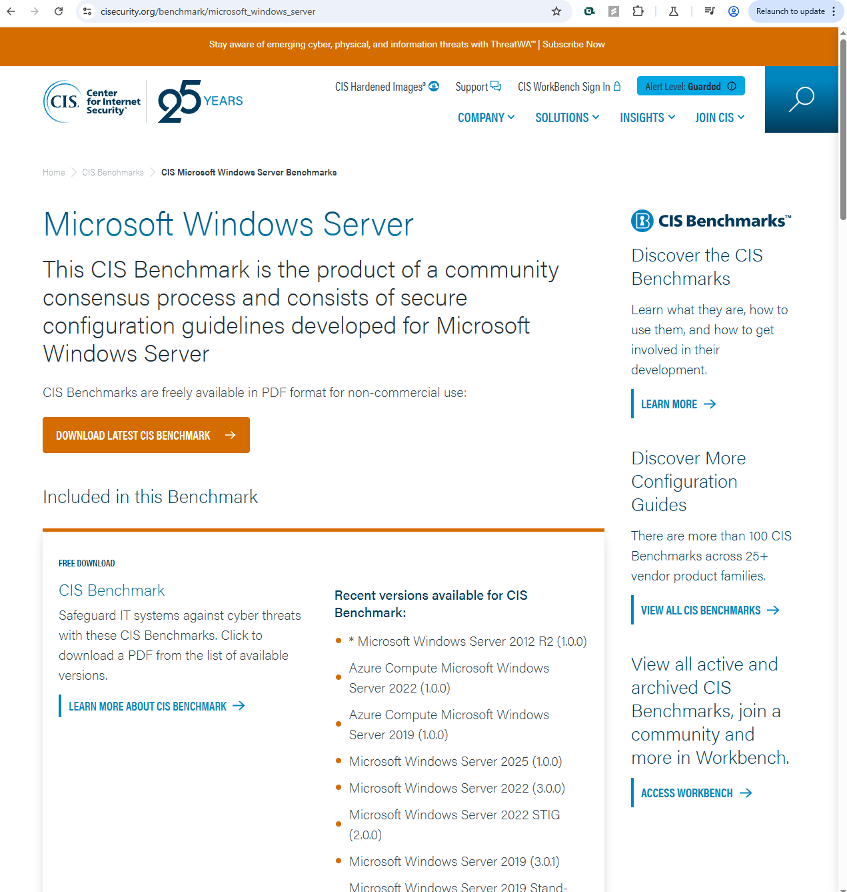

# IoC and Threat Intelligence Lab Summary

This lab focused on reviewing Indicators of Compromise (IoCs), exploring threat intelligence platforms, and utilizing policy frameworks and security benchmarks to understand practical applications in cybersecurity.

---

## Key Topics

- **Indicators of Compromise (IoCs)**
  - Types: File hashes (MD5, SHA1, SHA256), IP addresses, domain names, URLs, hostnames
  - Usage: Help identify signs of a compromise across systems and networks
  - Key characteristic: They are historical and reactive — showing that a system was likely breached

---

## Threat Intelligence Search

- **Platform:** AlienVault OTX (Open Threat Exchange)
- **Example Search:** "Mirai" botnet
- **Results Reviewed:**
  - Pulses containing malicious IPs, domains, hashes
  - Community-contributed threat data
  - Tags and metadata related to malware behavior

  
_Example: IoCs retrieved from an OTX pulse for Mirai malware_

---

## Exploit and Vulnerability Research

- **Exploit Database (Exploit-DB):**
  - Searched for recent vulnerabilities
  - Used filters (e.g., Platform, Type, Author) to find relevant exploits
  - Reviewed proof-of-concept code and CVE references

  
_Exploit-DB filtered by platform and type_

---

## Security Policy Templates

- **Source:** SANS.org Security Policy Templates
- **Templates Reviewed:**
  - Wireless Communication Policy
  - Remote Access Policy
- **Task:** Customized template to fit a fictional or real organization
  - Example: Updated Wireless Policy with allowed encryption types, allowed SSIDs, etc.

  
_Customized Wireless Communication Policy with organization-specific details_

---

## CIS Benchmarks

- **Center for Internet Security (CIS):**
  - Reviewed benchmarks for:
    - Windows 10
    - Ubuntu Linux
    - AWS
  - Understand how these serve as hardening guides

  
_Viewing available benchmarks for various platforms_

---

## What I Learned

- How to gather IoCs from live threat intelligence platforms like AlienVault OTX
- The differences and uses of various IoC types (hashes, IPs, URLs, hostnames)
- Navigating exploit databases to identify current vulnerabilities and PoCs
- The importance of standardized security policies and how to tailor them to organizational needs
- Where to find CIS benchmarks and how to use them for hardening operating systems and cloud environments
- That cybersecurity defense is as much about using trusted sources and policies as it is about tools

---

## Tools & Resources Used

- [AlienVault OTX](https://otx.alienvault.com/)
- [Exploit-DB](https://www.exploit-db.com/)
- [SANS Security Policy Templates](https://www.sans.org/information-security-policy/)
- [CIS Benchmarks](https://www.cisecurity.org/cis-benchmarks)

---
