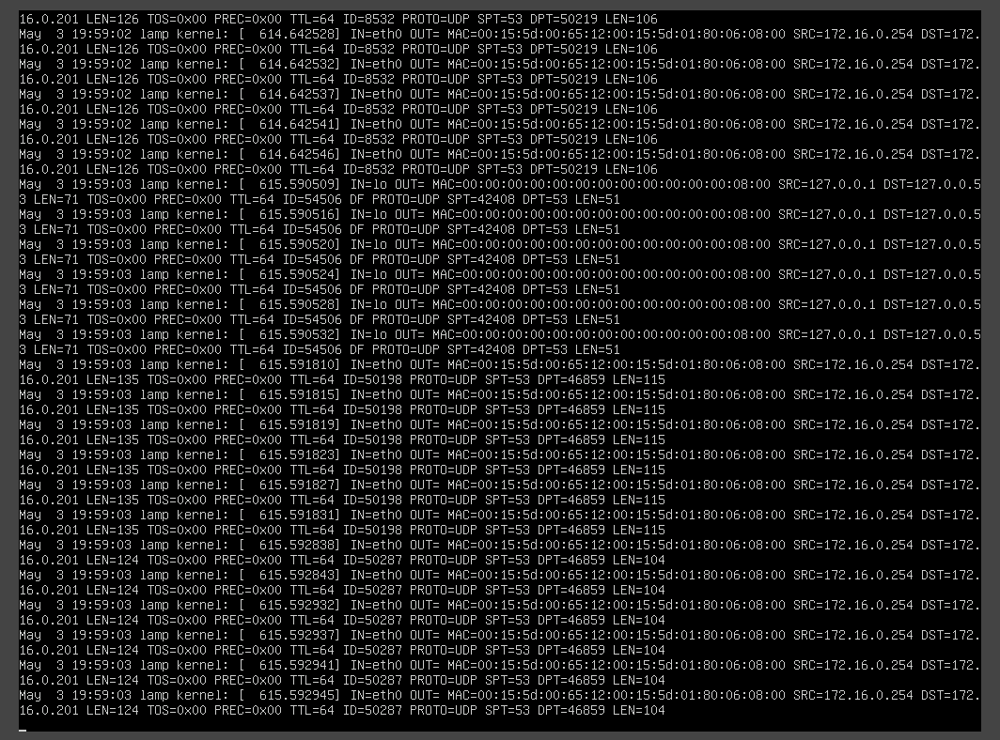
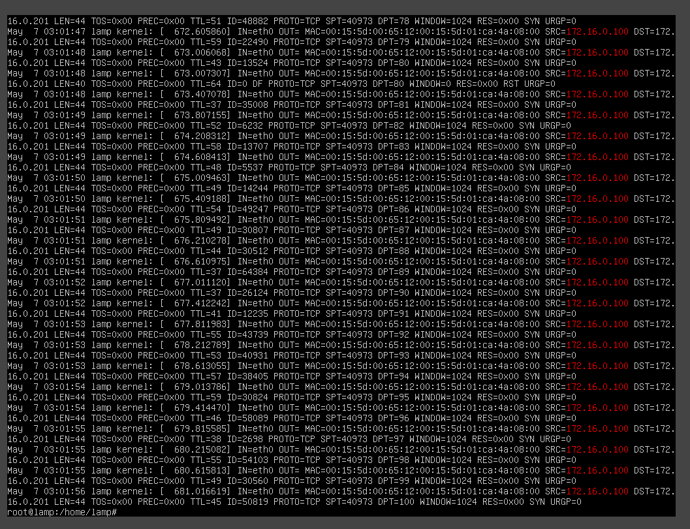
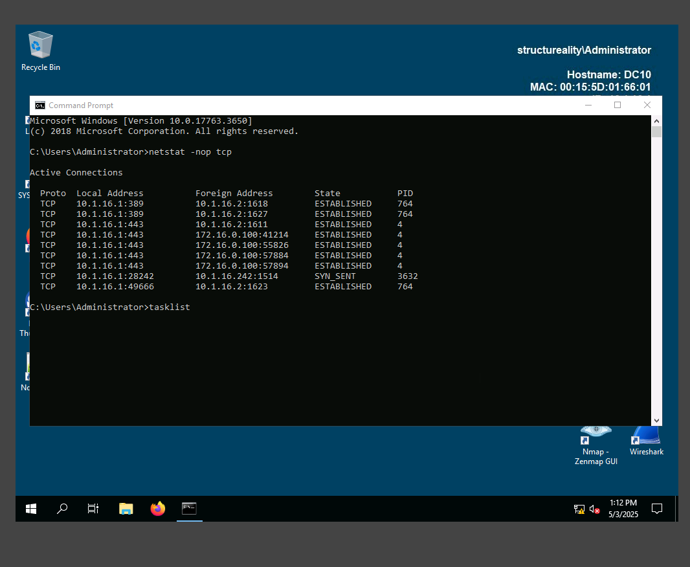
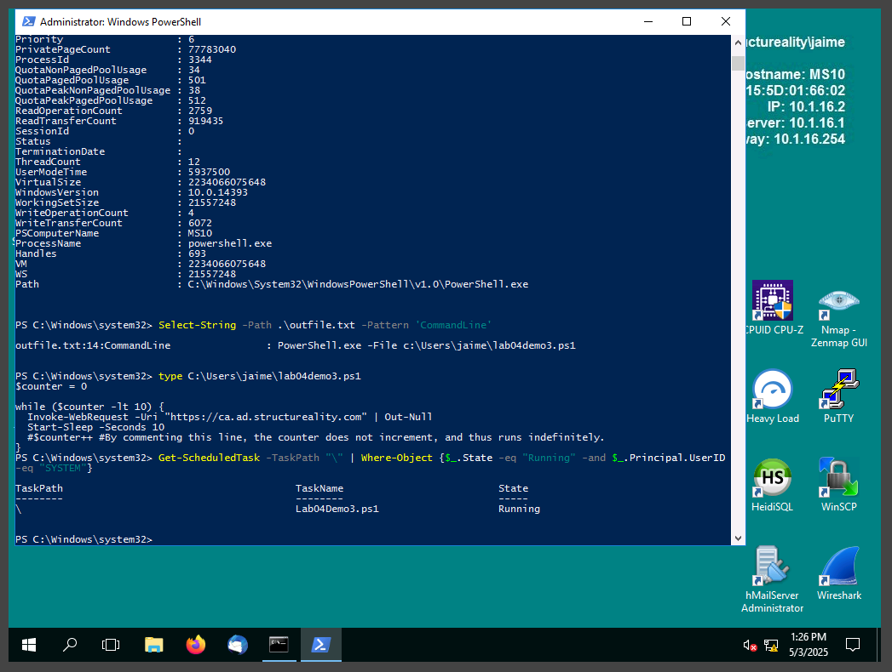
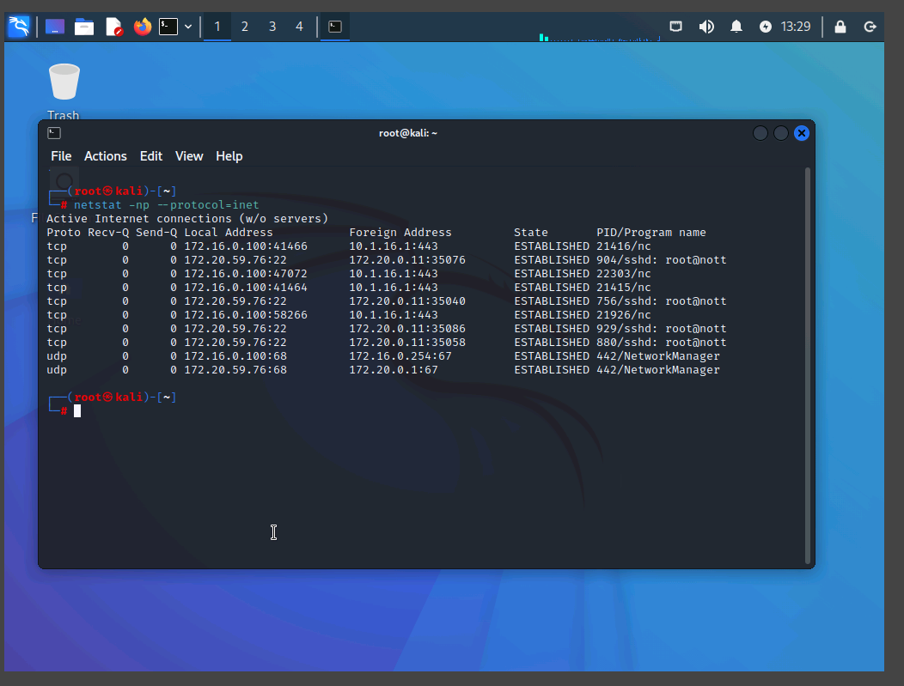
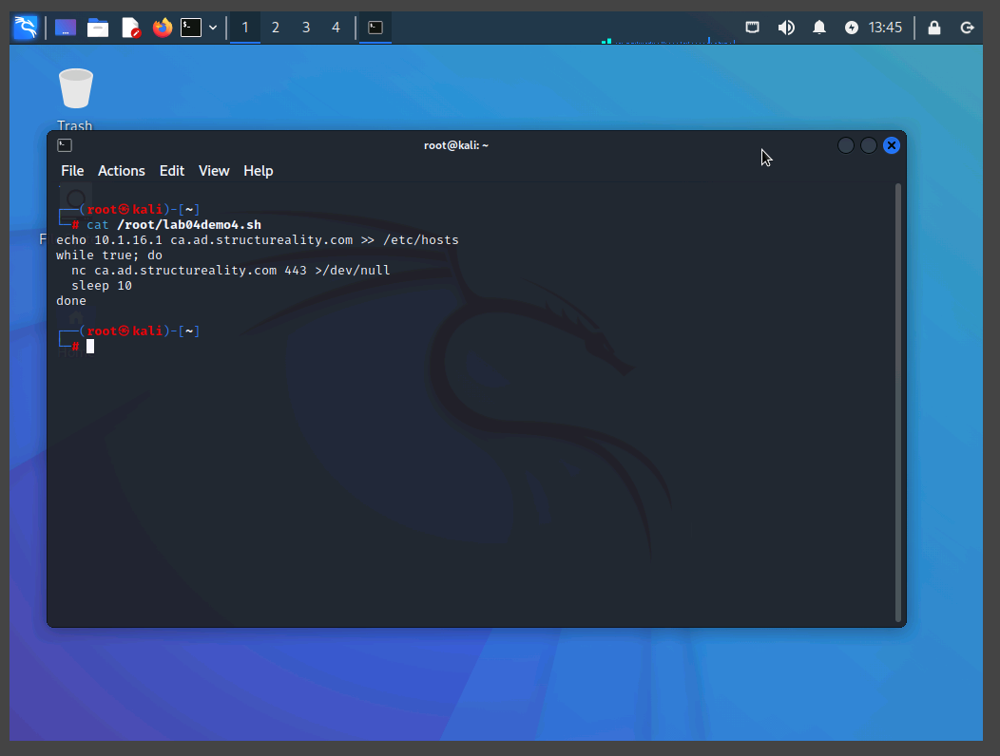
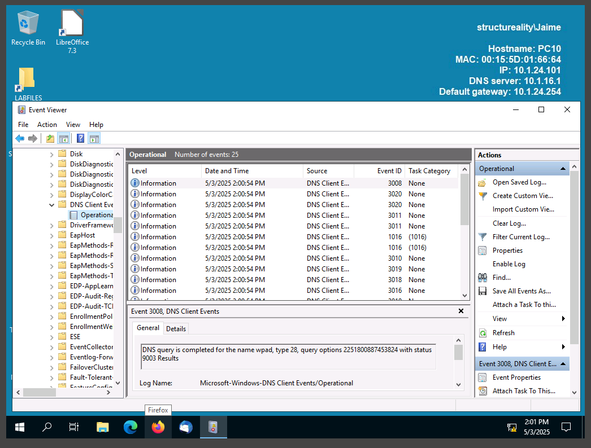
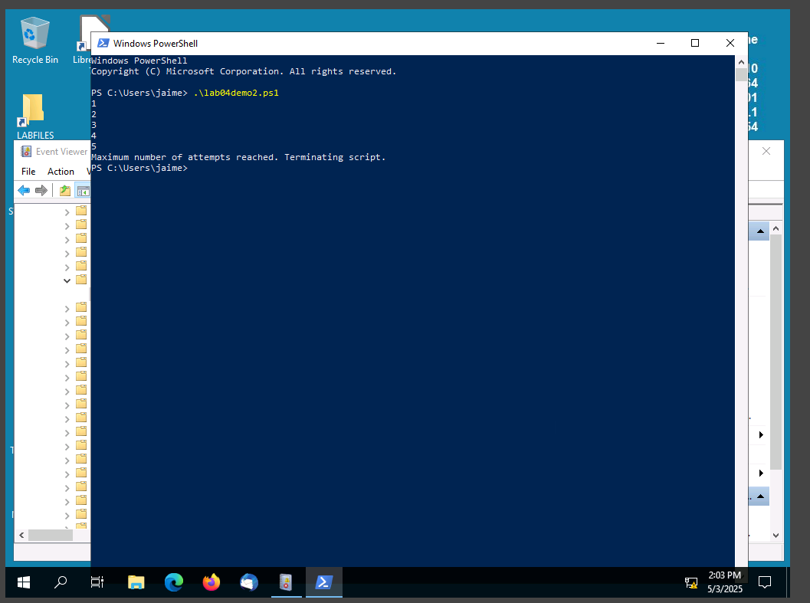
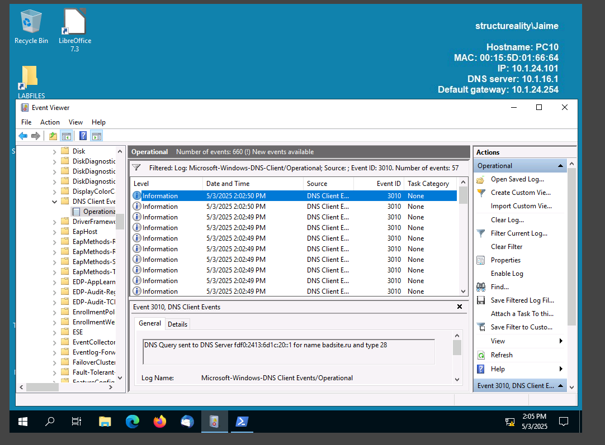
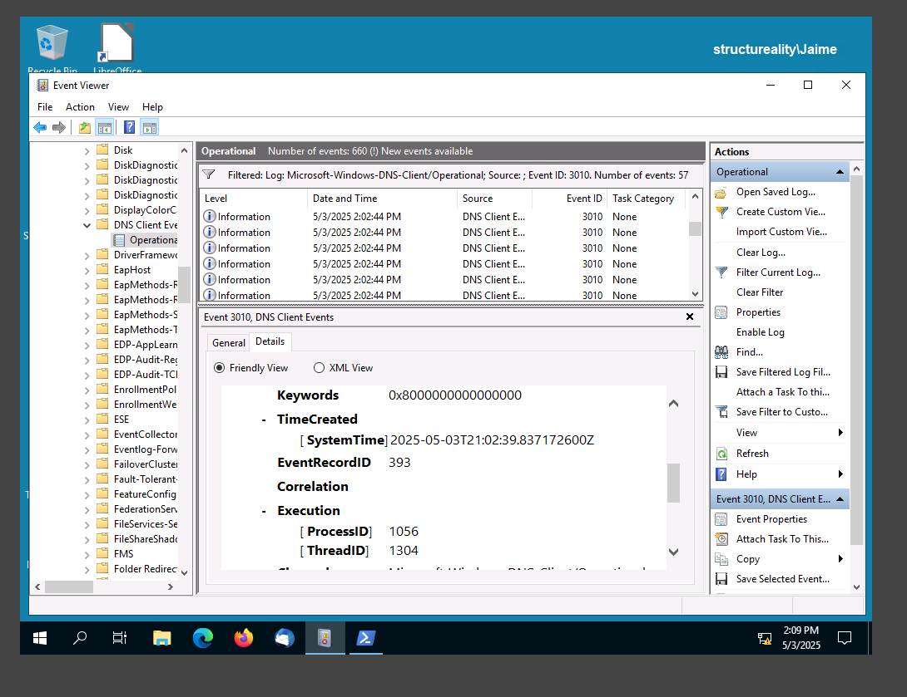

# Assisted Cybersecurity Lab: Performing Threat Hunting

## Overview

This lab exercise focused on threat hunting and identifying Indicators of Compromise (IoCs) using multiple virtual machines in a simulated enterprise network. As a cybersecurity analyst for Structureality Inc., the goal was to discover suspicious network activity using firewall logs, `netstat`, and process analysis.

---

## Lab Environment

The following virtual machines were used:

| Hostname | Role                         | OS Version          |
| -------- | ---------------------------- | ------------------- |
| LAMP     | Ubuntu web server            | Ubuntu (LAMP stack) |
| KALI     | Penetration testing machine  | Kali Linux          |
| DC10     | Domain controller & web host | Windows Server 2019 |
| MS10     | Internal workstation         | Windows Server 2016 |
| PC10     | Client machine               | Windows Server 2019 |

---

## Objectives

The lab covered the following CompTIA CySA+ objectives:

- **1.2** Analyze indicators of potentially malicious activity
- **1.3** Use appropriate tools or techniques to determine malicious activity
- **1.4** Compare and contrast threat-intelligence and threat-hunting concepts
- **3.2** Perform incident response activities

---

## Part 1: Enable and Monitor Network Logging on LAMP

**Steps Performed:**

1. Enabled input logging with iptables:

   ```bash
   iptables -A INPUT -j LOG
   ```

2. Exported iptables rules to a file:

   ```bash
   iptables -S > /home/lamp/filter-list.txt
   ```

3. Monitored the kernel log:

   ```bash
   tail -f /var/log/kern.log
   ```

  
Screenshot of tail -f /var/log/kern.log capturing port scan activity from Lamp.

## Part 2: Simulate Port Scanning from Kali

1. Ran the scan from Kali using:

   ```bash
   ./lab04demo1.sh
   ```

2. Discovered sequential port scanning from Kali's IP.

3. Verified via Lamp:

   ```bash
   grep 172.16.0.100 /var/log/kern.log
   ```

4. Analyzed log structure for signs of IoC.



Screenshot of /var/log/kern.log entries showing SRC=172.16.0.100 and sequential DPT= values.

## Part 3: Detect Abnormal HTTPS Traffic on DC10

1. Ran:

   ```cmd
   netstat -nop tcp
   ```

2. Identified PID associated with suspicious HTTPS connections.

3. Retrieved process info:

   ```cmd
   tasklist /FI "PID eq <PID>"
   ```

  
Screenshot of netstat showing multiple connections to port 443 from suspicious sources.

## Part 4: Validate Legitimate HTTPS Sessions on MS10

1. Ran the same netstat and tasklist commands.

2. Used PowerShell to check scheduled tasks:

   ```powershell
   Get-WmiObject win32_process -filter 'processid=<PID>' > outfile.txt
   ```

   ```powershell
   Select-String -Path .\outfile.txt -Pattern 'CommandLine'
   ```

3.Ran the script lab04demo3.ps1.

  
Screenshot of PowerShell showing the script and task running.

## Part 5: Identify Malicious HTTPS Sessions from Kali

1. Ran:

   ```bash
   netstat -np --protocol=inet
   ```

2. Observed multiple HTTPS connections to DC10.

3. Analyzed malicious script:

   ```bash
   cat /root/lab04demo4.sh
   ```

- Looped netstat connection to simulate resource exhaustion.

  
Screenshot of the Kali netstat output showing multiple persistent HTTPS connections.
  
 Screenshot of lab04demo4.sh content showing infinite loop and suppressed output.

## Part 6: Investigate Strange DNS Activity on PC10

**Scenario:**  
The ISP security team reported suspicious DNS activity originating from the internal network. You began your investigation on PC10, a system previously linked to poor security practices, and enabled DNS client logging to identify Indicators of Compromise (IoCs).

---

### Step 1: Enable DNS Client Logging

1. Logged into PC10 as `jaime` (Domain Admin).
2. Opened **Event Viewer** and navigated to:
   Applications and Services Logs > Microsoft > Windows > DNS Client Events > Operational
3. Enabled **Operational log** by right-clicking it → **Properties** → checked **Enable Logging**.

  
Screenshot showing Event Viewer with DNS Client Events > Operational enabled.

### Step 2: Generate Simulated Malicious DNS Traffic

1. Launched PowerShell as Administrator.
2. Ran the script:
   ```powershell
   .\lab04demo2.ps1
   ```
3. Script executed 5 iterations of DNS queries and exited.

  
Screenshot of PowerShell terminal running lab04demo2.ps1 and output.

### Step 3: Filter and Analyze DNS Logs

1. Returned to Event Viewer and refreshed the Operational log.

2. Filtered by Event ID 3010 (initial DNS query):

```
Actions > Filter Current Log… > Event IDs: 3010
```

3. Investigated FQDNs in the filtered results.

4. Identified suspicious FQDN:

```
badsite.ru
```

- Stood out due to its unusual domain and external country TLD.
- Was not part of the internal .ad.structureality.com domain.

  
Screenshot of Event ID 3010 showing DNS query to badsite.ru.

### Step 4: Determine Frequency and Behavior of Malicious Queries

1. Used Find… tool to locate multiple occurrences of badsite.ru
2. Counted total queries and noted timing differences between type 1 (IPv4) entries.
3. Observed the DNS query to badsite.ru repeated at 20-second intervals.

### Step 5: Identify the Process That Generated the Queries

1. While viewing an entry for badsite.ru, opened the Details tab.

2. Expanded:

```
Details > System > Execution > [ProcessID]
```

3. Recorded the PID associated with the DNS queries.

4. If the process had been persistent, it could be further investigated using:

```cmd
tasklist /FI "PID eq <PID>"
```

  
Screenshot of Event Viewer showing PID under Execution in the Details tab.

## Conclusion & Lessons Learned

This lab provided practical experience in identifying and investigating Indicators of Compromise (IoCs) through log analysis and DNS monitoring. Across both exercises, you leveraged built-in system tools—Event Viewer, PowerShell, and command-line utilities—to uncover simulated malicious activity within a Windows environment.

### Key Skills Applied:

- **Threat Intelligence Analysis:** Reviewed external sources such as threat feeds and exploit databases to build context around security incidents.
- **Log Analysis:** Enabled and interpreted Windows event logs (Security, DNS Client) to track user behavior and network activity.
- **DNS Threat Hunting:** Used DNS logging to detect suspicious outbound queries, ultimately identifying beaconing behavior linked to a suspicious domain.
- **Process Correlation:** Mapped DNS events to initiating processes using Event Viewer’s PID details, a critical skill in identifying malware or unauthorized scripts.
- **Security Best Practices Reinforced:**
  - Importance of enabling and collecting the right logs for visibility.
  - Value of filtering by specific Event IDs to reduce noise and focus on relevant data.
  - Need for validating findings to distinguish false positives from real threats.

### Final Thoughts:

This lab emphasized the importance of detailed log review and endpoint telemetry in modern cybersecurity defense. Even when alerts are vague (e.g., “strange DNS activity”), a methodical approach using system tools can uncover meaningful threats. By identifying patterns like beaconing or unauthorized access attempts, defenders can respond early—before a full compromise occurs.

Understanding where to look, how to filter, and what to correlate are foundational to effective threat hunting, and this exercise helped build confidence in those investigative skills.
