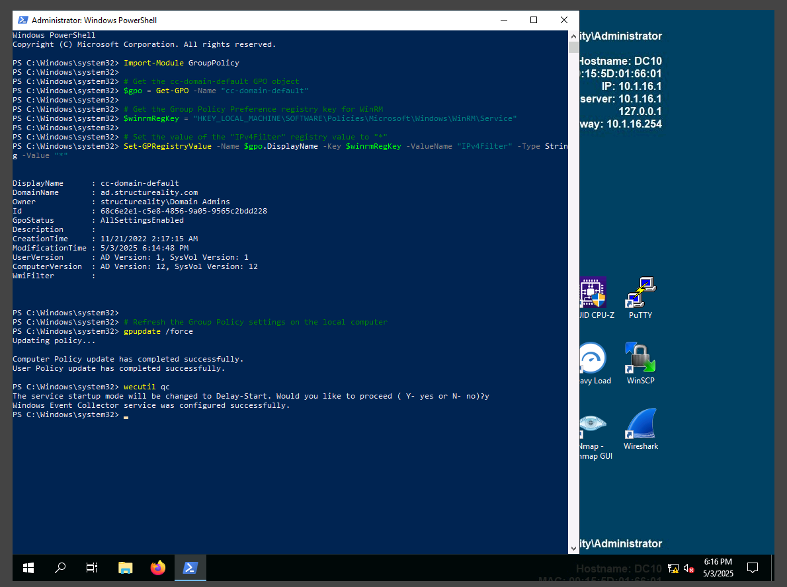
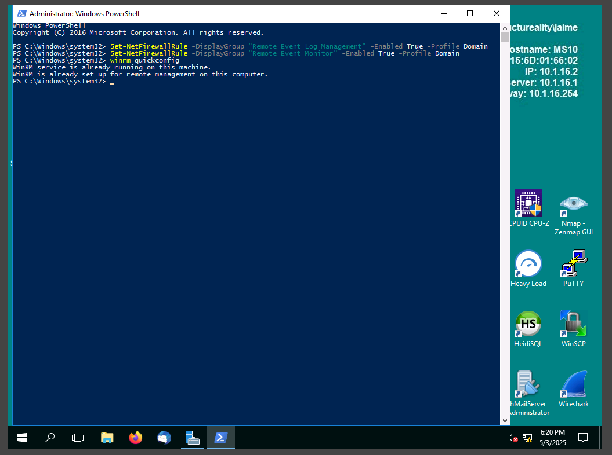
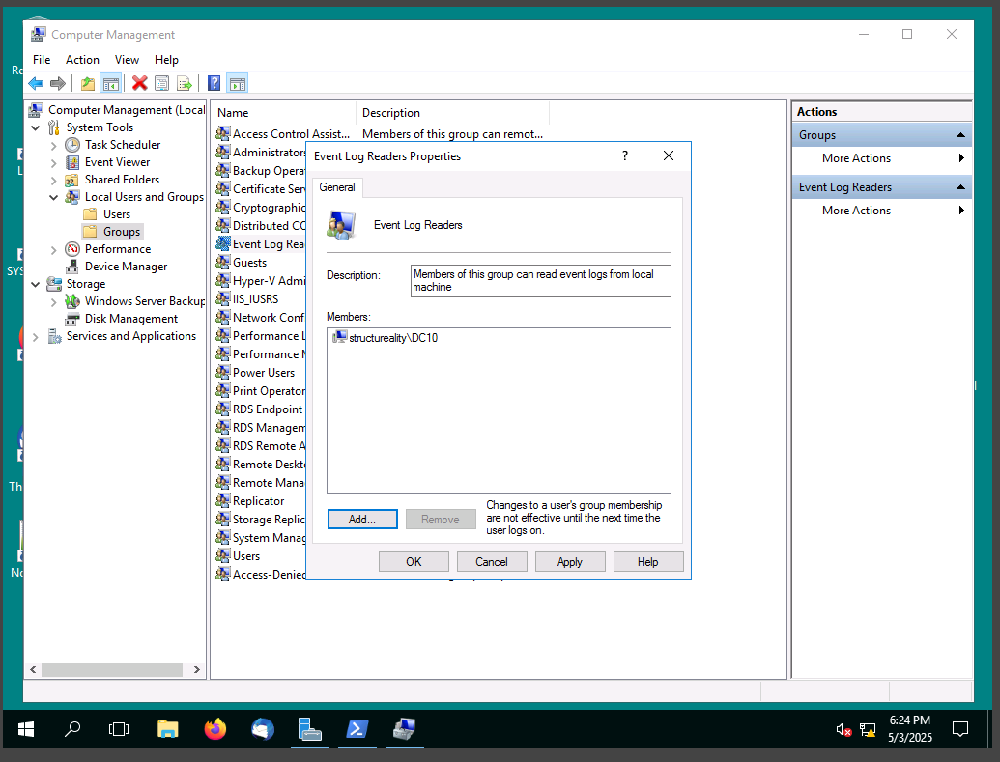
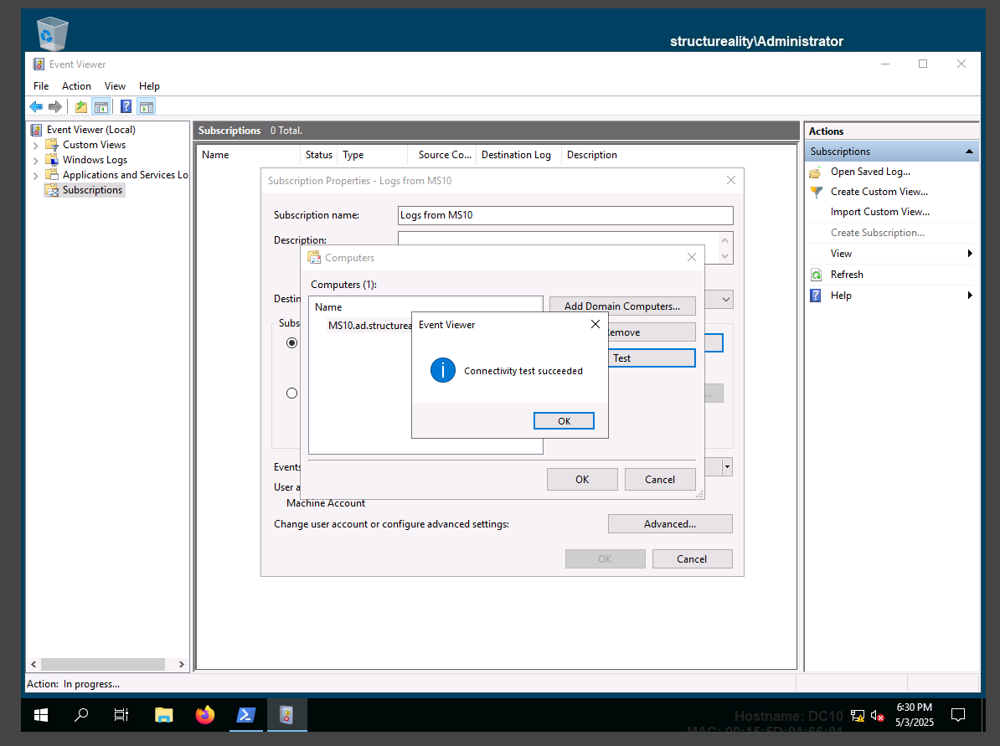
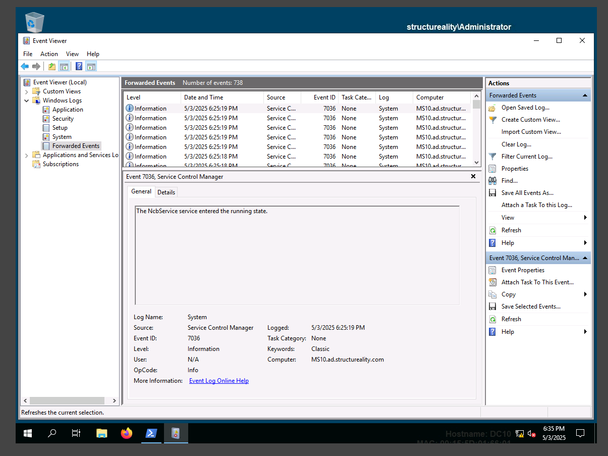
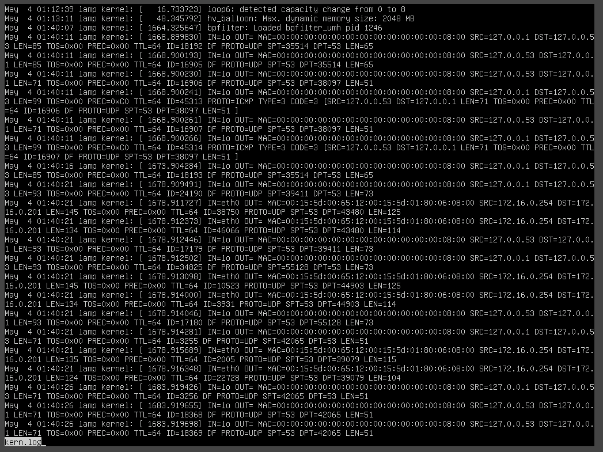
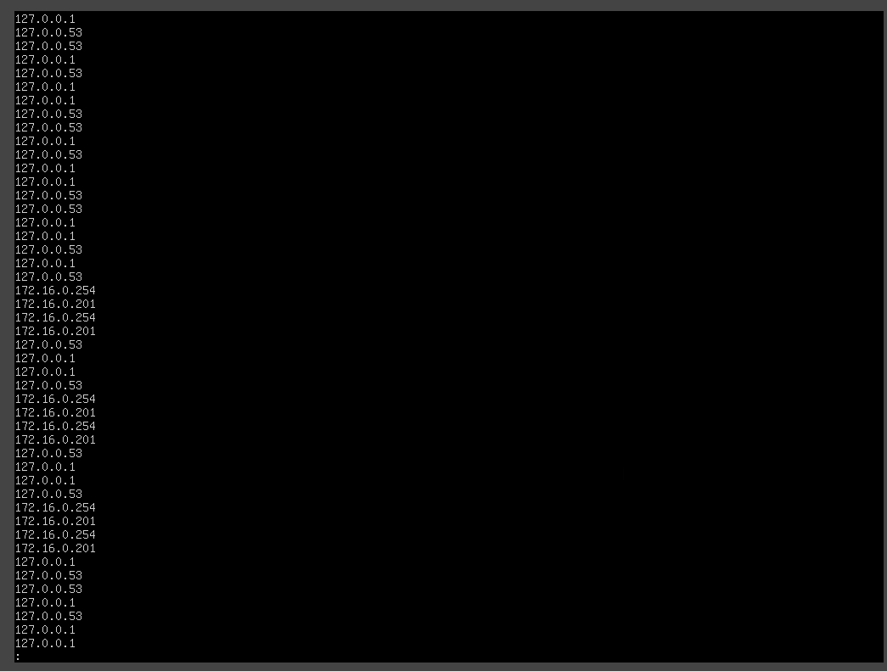
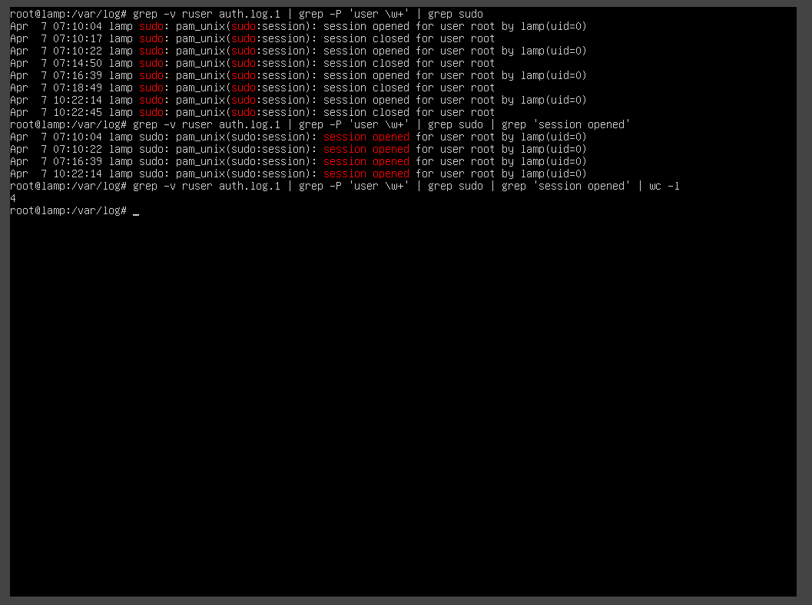

# Assisted Lab: Configuring Centralized Logging

## Overview

This lab simulates the responsibilities of a cybersecurity analyst at Structureality Inc., where centralized logging and log analysis are configured and tested using Windows Server and Linux systems.

## Objectives Covered

- Explain the importance of system and network architecture in security operations (CySA+ 1.1)
- Analyze indicators of potentially malicious activity (CySA+ 1.2)
- Use appropriate tools or techniques to detect malicious activity (CySA+ 1.3)

## Lab Environment

- **Windows Server 2019 (DC10)** – Event Log Collector
- **Windows Server 2016 (MS10)** – Event Log Source
- **Ubuntu Server (LAMP)** – Used for grep and regex exercises on log files

## Centralized Logging Setup

### Step 1: Enable Windows Event Collector on DC10

Used PowerShell command:

```powershell
wecutil qc
```

  
PowerShell showing successful execution of wecutil qc

### Step 2: Configure MS10 Firewall and WinRM

Enabled firewall rule:

```powershell
Set-NetFirewallRule -Name "WINRM-HTTP-In-TCP-PUBLIC" -RemoteAddress Any
```

Enabled WinRM service::

```powershell
winrm quickconfig
```

  
PowerShell showing WinRM configured and firewall rule enabled

### Step 3: Add DC10 to Event Log Readers on MS10

- Opened Local Users and Groups > Groups > Event Log Readers
- Added DC10$ as a member

  
Group membership showing DC10$ in Event Log Readers

### Step 4: Configure Subscription on DC10

- Opened Event Viewer > Subscriptions
- Created new subscription using Computer Group with MS10
- Selected "Forwarded Events" as the destination log

  
Subscription configuration screen in Event Viewer

### Step 5: Verify Logs are Forwarded

- Forwarded logs appeared in DC10 under "Forwarded Events"

  
Forwarded Events log showing entries from MS10

## Log Analysis on Ubuntu (LAMP)

### Step 1: Enable iptables Logging

- Enabled and verified log entries written to /var/log/kern.log

  
kern.log entries showing iptables traffic

### Step 2: Extract IPv4 Addresses Using grep

Used regex to extract IPs: bash

```bash
grep -oP '(\d{1,3}\.){3}\d{1,3}' kern.log
```

  
Terminal output showing list of extracted IPv4 addresses

## Step 3: Analyze User Sessions in auth.log.1

Filtered user session activity:

```bash
grep -v ruser auth.log.1 | grep -P 'user \w+' | grep sudo | grep 'session opened'
```

Counted session lines:

```bash
... | wc -l
```

  
Terminal output showing matching log lines and total count

## What I Learned

- How to set up centralized event collection between Windows systems
- How to enable and use Event Viewer Subscriptions
- How to configure local firewall and WinRM to support log forwarding
- Basic use of grep and regular expressions to extract meaningful data from Linux logs
- How to identify user activity and IP addresses from log files
