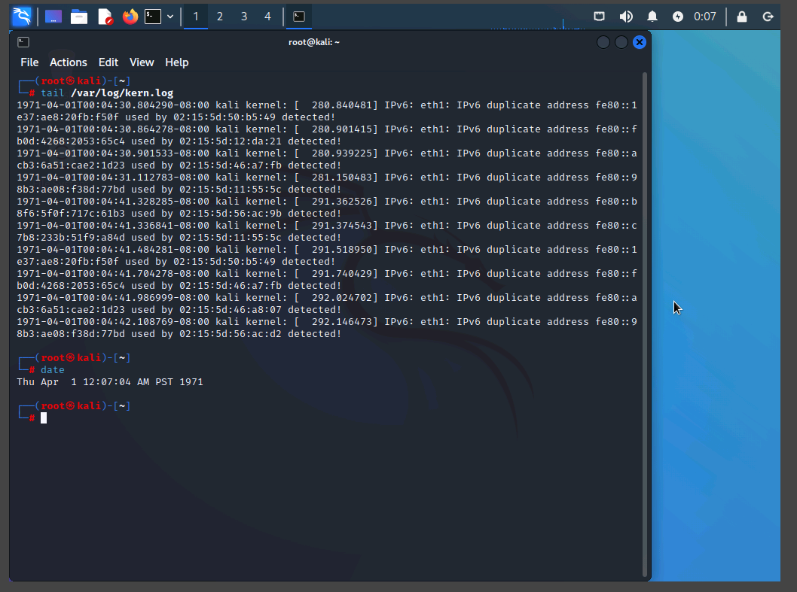
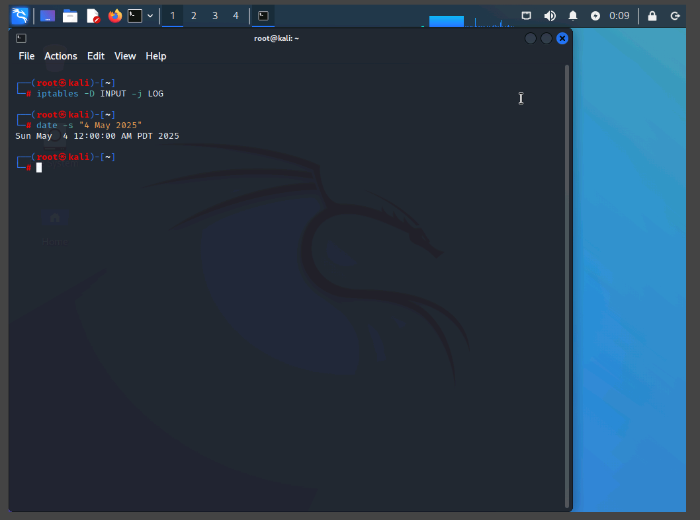
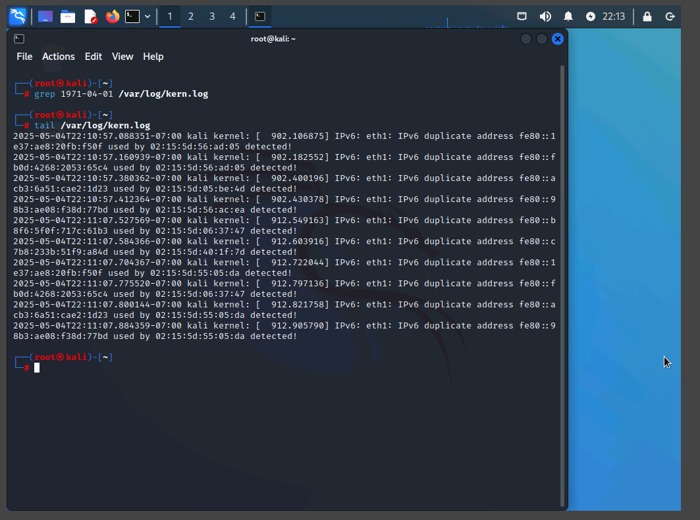
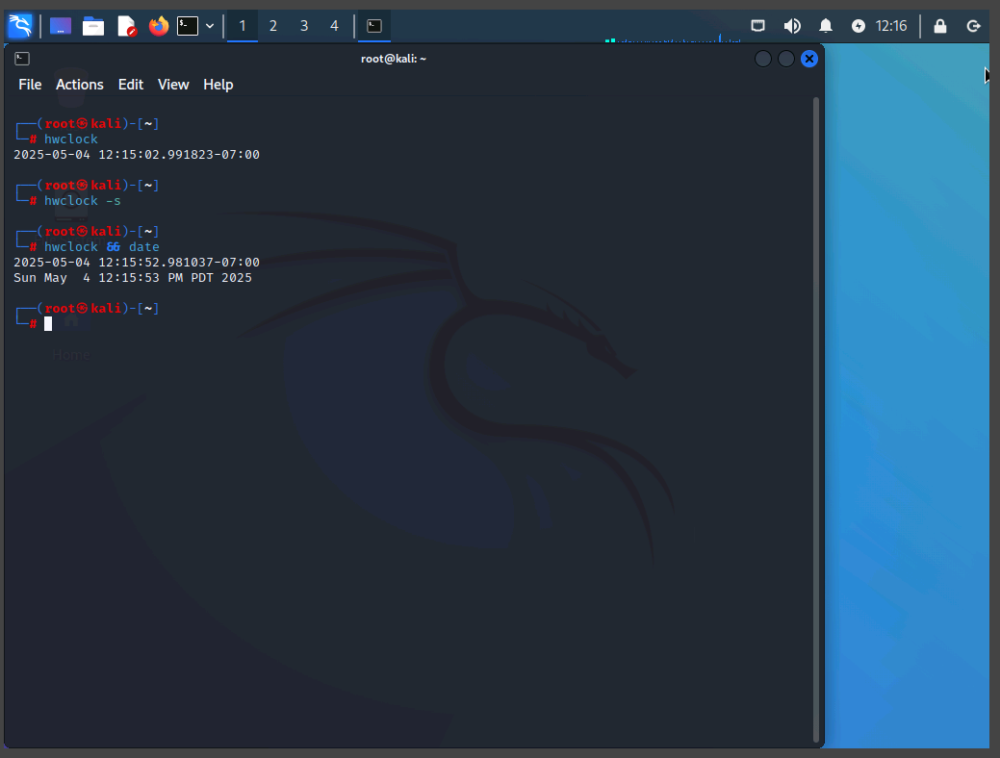
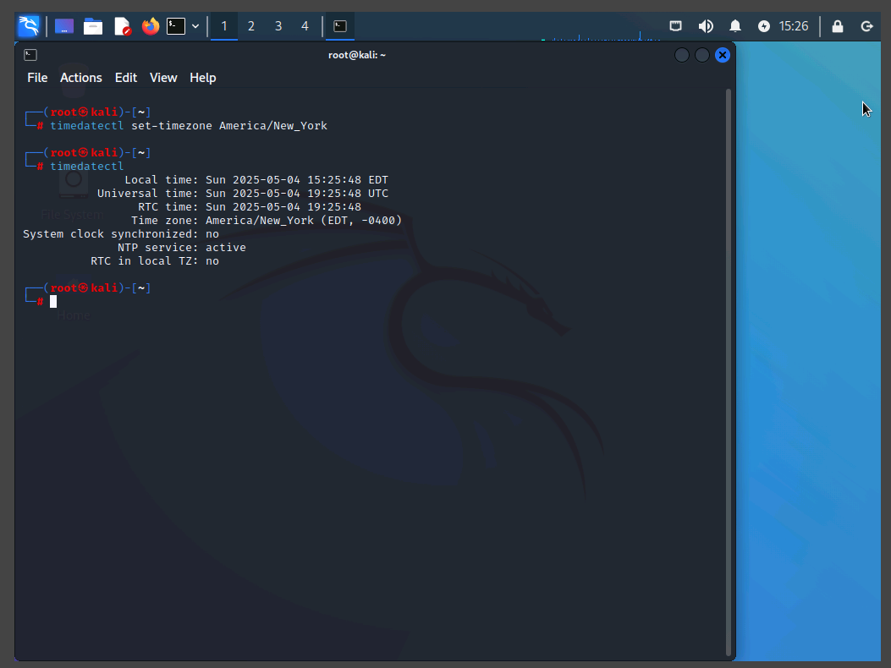
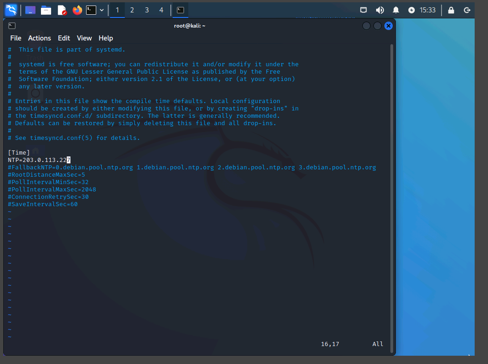
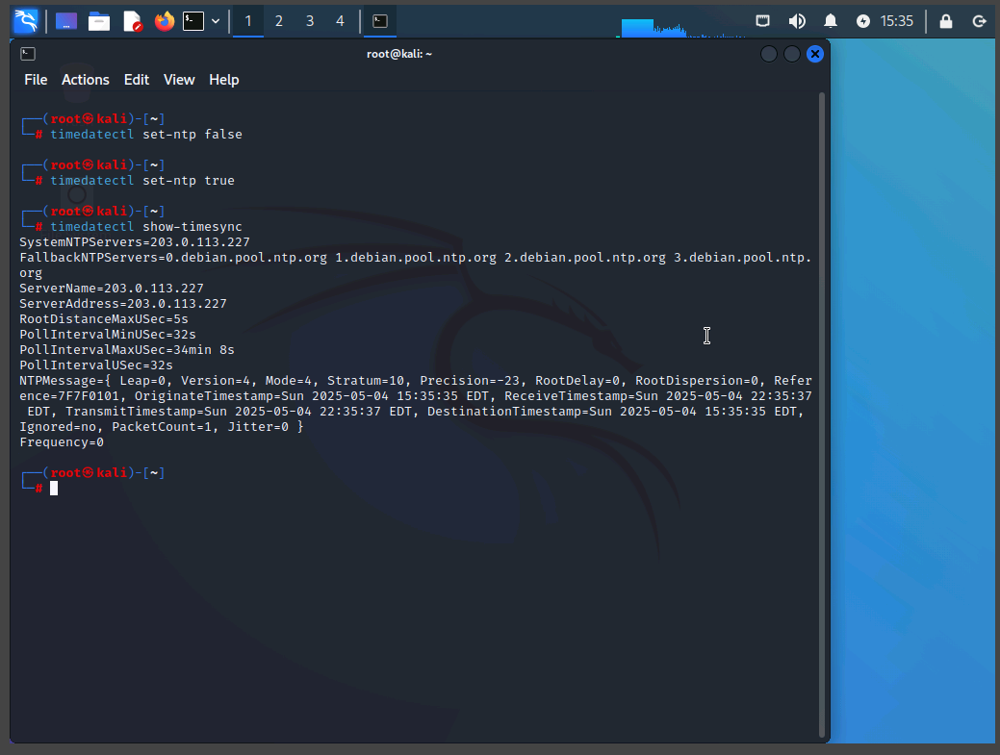
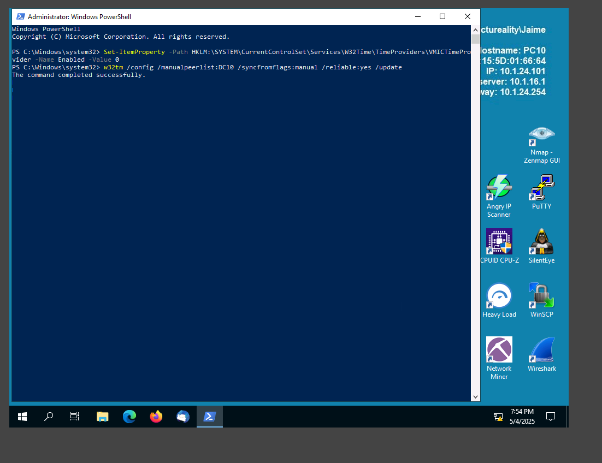
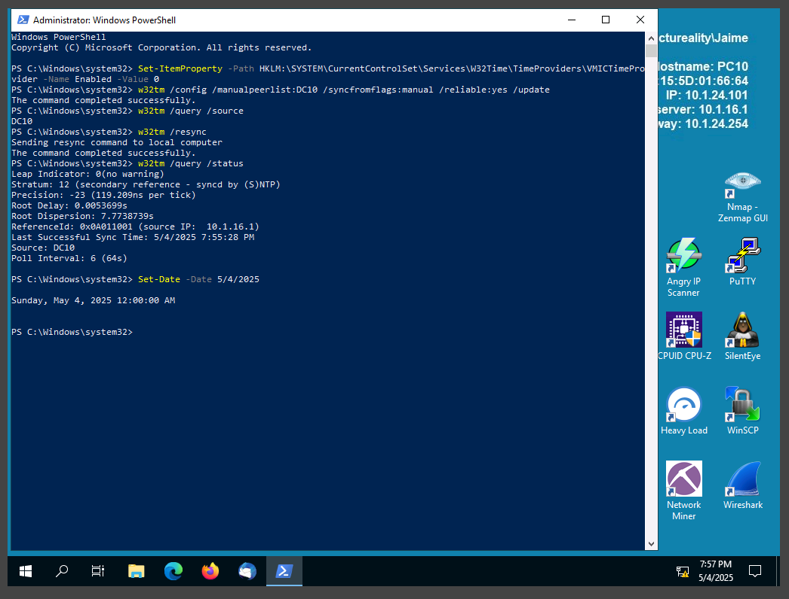

# Assessing Time Synchronization Errors – Assisted Lab

## Overview

This assisted lab focused on identifying and correcting time synchronization issues on Linux and Windows systems. Accurate system time is critical in cybersecurity for log integrity, incident response, and forensic analysis.

**Lab Environment:**

- Kali Linux (Pen-testing build)
- Windows Server 2019 (DC10 – Domain Controller)
- Windows Server 2019 (PC10 – Client)

## Objectives

Aligned with CompTIA CySA+:

- 1.1: Understand system and network architecture’s role in security operations.
- 4.2: Demonstrate effective incident response reporting and communication.

---

## Part 1: Identify and Correct Log File Time Errors (Kali Linux)

### Inspect the `kern.log` File

```bash
tail /var/log/kern.log
```

Result: Log entries showed a date of 1971-04-01, indicating the system time was incorrect.

```bash
tail date
```

Result:Thu Apr 1 00:00:00 UTC 1971

Output of `tail /var/log/kern.log` showing 1971 timestamp and date

### Set Correct System Date and Time

```bash
date -s "6 May 2025"
date -s "14:26:00"
```



### Update Log File Timestamps

```bash
sed -i 's/1971-04-01/2025-05-06/g' /var/log/kern.log
```

Verify the change:

```bash
grep 1971-04-01 /var/log/kern.log
tail /var/log/kern.log
```



## Part 2: Sync Clocks and Set Time Zone

### Check System and Hardware Clocks

```bash
hwclock
date
```

### Sync System Clock to Hardware Clock

```bash
hwclock -s
```

Confirm sync:

```bash
hwclock && date
```


Output of `hwclock` and `date` showing matching times

### Set Time Zone

Determine zone:

```bash
tzselect
```

Set zone:

```bash
timedatectl set-timezone America/New_York
```

Check:

```bash
timedatectl
```



`timedatectl` showing correct timezone

## Part 3: Enable and Configure NTP (Linux)

### Check Time Sync Status

```bash
timedatectl timesync-status
```

Enable NTP:

```bash
timedatectl set-ntp true
```

Edit NTP server list:

```bash
vim /etc/systemd/timesyncd.conf
```

Add or edit the line:

```ini
NTP=203.0.113.227
```

Restart time sync:

```bash
timedatectl set-ntp false
timedatectl set-ntp true
```

Verify:

```bash
timedatectl timesync-status
timedatectl show-timesync
```


`/etc/systemd/timesyncd.conf` file edit

`timedatectl show-timesync` with the new NTP server

## Part 4: Sync and Configure NTP on Windows (DC10 & PC10)

### Disable Hypervisor Time Sync

Run as Administrator (PowerShell):

```powershell
Set-ItemProperty -Path "HKLM:\SYSTEM\CurrentControlSet\Services\W32Time\TimeProviders\Vmictimeprovider" -Name "Enabled" -Value 0
```

### Configure DC10 as Stratum 1 NTP Server

```powershell
w32tm /config /manualpeerlist:"time.windows.com" /syncfromflags:manual /reliable:YES /update
Restart-Service w32time
```



### Configure PC10 as Stratum 2 (Sync with DC10)

```powershell
w32tm /config /manualpeerlist:"DC10" /syncfromflags:manual /update
w32tm /resync
```

Verify NTP settings:

```powershell
w32tm /query /status
w32tm /query /peers
```



`w32tm /query /status` showing PC10 synced to DC10

## Key Takeaways

- Time desynchronization can lead to inaccurate log analysis and hinder incident response.

- It's essential to align system, hardware, and domain controller clocks using reliable NTP sources.

- Timestamp integrity in logs is critical for correlating security events across systems.
