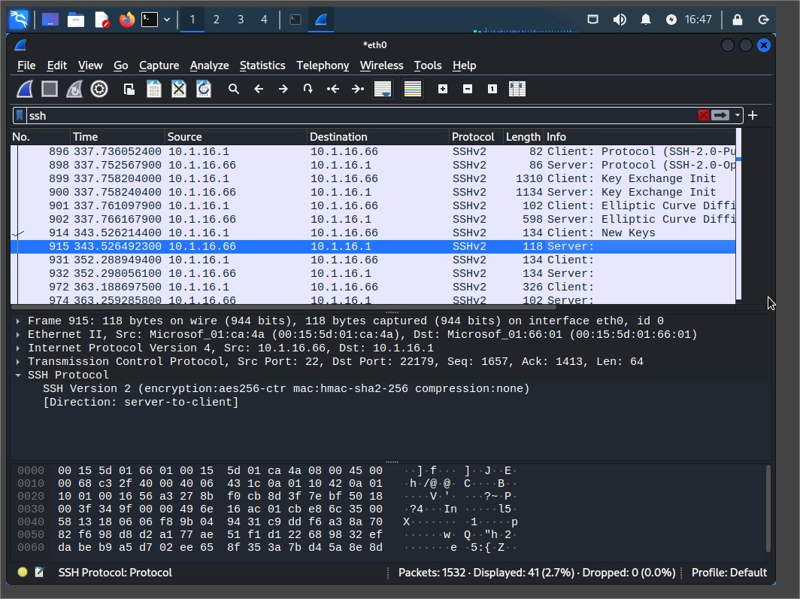

# Assisted Cybersecurity Lab: Performing Passive Scanning with Wireshark

## Overview

This lab demonstrates passive vulnerability scanning using **Wireshark** in a simulated network environment. As a cybersecurity analyst for **Structureality Inc.**, I examined ICMP and SSH traffic to determine OS fingerprinting, plaintext communication exposure, and encryption characteristics of secure protocols.

---

## Objectives

Aligned with **CompTIA CySA+** objectives:

- **2.1**: Implement vulnerability scanning methods and concepts
- **2.2**: Analyze output from vulnerability assessment tools
- **2.3**: Analyze data to prioritize vulnerabilities
- **2.5**: Understand vulnerability response and management

---

## Lab Environment

- **KALI VM**: Running Wireshark and terminal commands.
- **DC10 VM**: Simulated target running Windows Server.
- **Network**: Internal server subnet (vLAN_SERVERS).

---

## Steps Performed

### 1. Launch Wireshark and Set Layout

- Opened Wireshark on the `eth0` interface.
- Changed layout to classic three-pane vertical format.

  
Wireshark interface with layout set to three vertical panes and eth0 interface capturing packets.

---

### 2. Generate and Analyze ICMP Traffic

- Ran `ping 10.1.16.1 -c 4` from Kali to DC10.
- Captured ICMP echo requests and replies.
- Applied filters:

  ```bash
  icmp and ip.src==10.1.16.66
  icmp and ip.src==10.1.16.1
  Identified ASCII payloads:
  ```

- Kali ➝ !"#$%&'()\*+,-./01234567 → Linux/Unix
- DC10 ➝ abcdefghijklmnopqrstuvwabcdefghi → Windows

### 3. Determine OS Based on ICMP Packet Size

| Originating Host  | Payload  | Total Packet | Size OS Type |
| ----------------- | -------- | ------------ | ------------ |
| Kali (10.1.16.66) | 48 bytes | 64 bytes     | Linux        |
| DC10 (10.1.16.1)  | 32 bytes | 48 bytes     | Windows      |

---

### 4. Identify Packet Filtering Behavior

Blocked ICMP on DC10:

```bash
netsh advfirewall firewall add rule name="ICMP Allow incoming V4 echo request" protocol=icmpv4:8,any dir=in action=block
```

Kali's ping to DC10 shows 100% packet loss, confirming filtering.

Wireshark ICMP display with missing replies (only requests) to indicate packet filtering.

### 5. SSH Traffic Analysis

- Captured SSH handshake and session from PuTTY client to Kali SSH server.
- Identified:
  - Client software: PuTTY_Release_0.77
  - Server software: OpenSSH_9.1p1 Debian-1
  - Encryption: aes256-ctr
  - MAC: hmac-sha2-256


SSH packets showing version banners and encryption negotiation in the Packet Details pane.

### 6. Determining Encrypted vs Plaintext Traffic

- ICMP payloads were readable in ASCII, indicating plaintext.
- SSH packets post-session setup were unreadable, indicating encryption.

<!-- 
 -->

|                         icmp packet                         |                        ssh packet                         |
| :---------------------------------------------------------: | :-------------------------------------------------------: |
|  |  |

Side-by-side comparison of ICMP vs SSH payloads in the Packet Bytes pane (one readable, one not).

## Findings

| Protocol | Key Findings                                                                               |
| -------- | ------------------------------------------------------------------------------------------ |
| ICMP     | Payload visible, indicating plaintext; can fingerprint OS based on payload and packet size |
| SSH      | Banner grabbing reveals software versions; payload encrypted after handshake               |

---

## Conclusions

This lab demonstrated the value of passive scanning using Wireshark:

- OS fingerprinting based on ICMP characteristics
- Detection of unencrypted traffic that could leak data
- Identification of client/server software versions via SSH banners
- Confirmation of encryption through payload analysis

## Passive scanning revealed actionable insights about misconfigurations, visibility into plaintext protocols, and OS behaviors without active exploitation.

## Recommendations

- Disable plaintext protocols or secure them using encryption (e.g., HTTPS, SFTP).
- Limit ICMP exposure unless required; enforce firewalls.
- Monitor banner versions and update software regularly to minimize known vulnerabilities.
- Establish encrypted baselines and detect deviations in security policy compliance.
