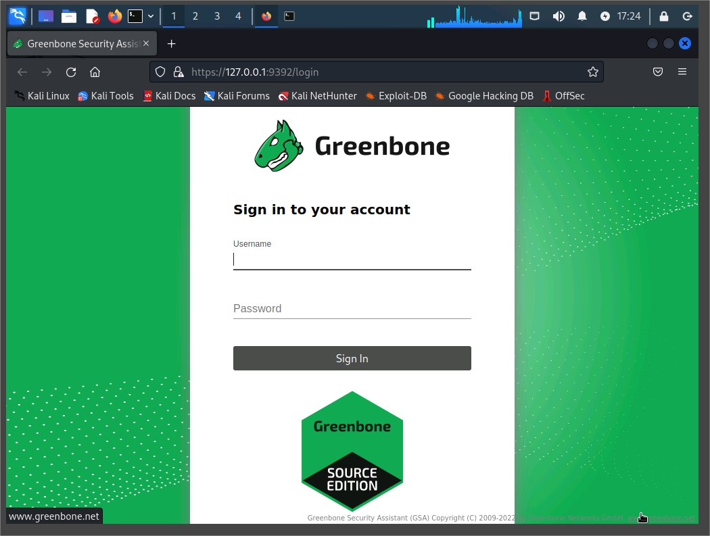
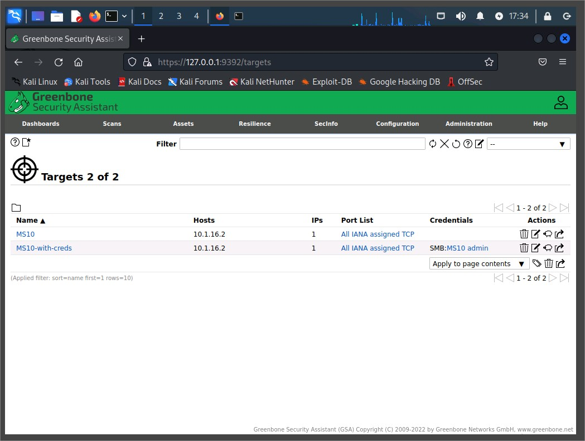
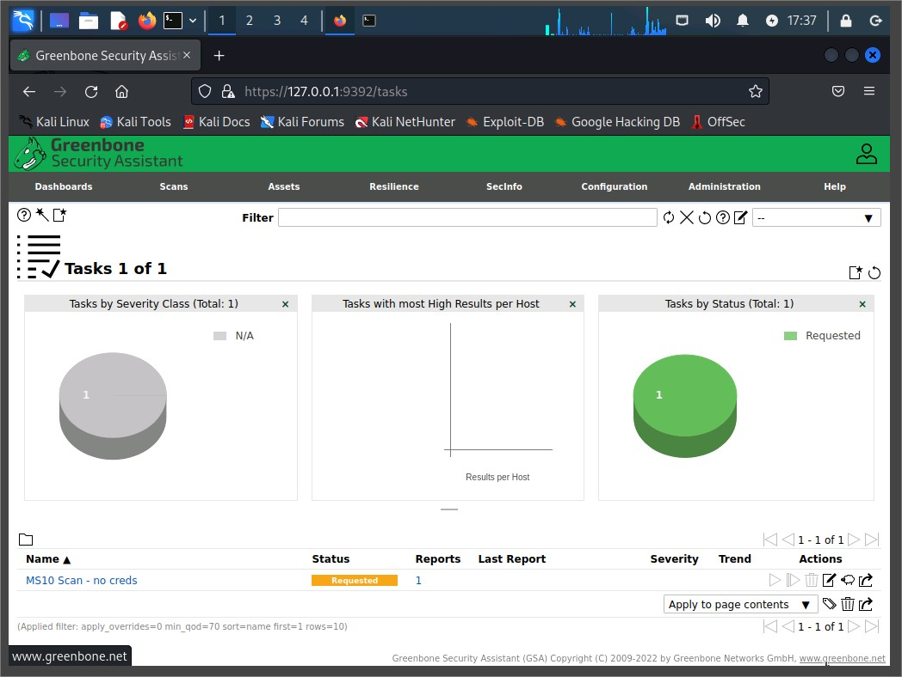
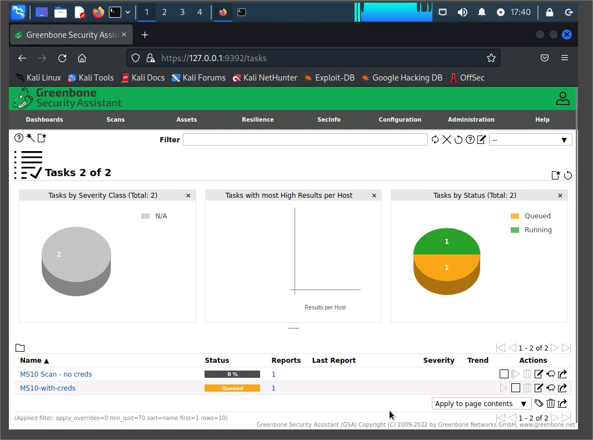

# Assisted Cybersecurity Lab: Performing Vulnerability Scanning

## Overview

In this lab, I performed vulnerability scans using **Greenbone Security Assistant (GSA)** on a Windows Server 2016 machine named **MS10** from a Kali Linux workstation. Both uncredentialed and credentialed scans were initiated to identify potential weaknesses and misconfigurations on a legacy system within a simulated internal server subnet.

---

## Objectives

This lab aligns with the following **CompTIA CySA+** exam objectives:

- **2.1**: Implement vulnerability scanning methods and concepts.
- **2.2**: Analyze output from vulnerability assessment tools.

---

## Environment

- **KALI VM**: Analyst workstation running Kali Linux and GSA.
- **MS10 VM**: Target machine running Windows Server 2016 (IP: `10.1.16.2`).
- **Tools Used**: Greenbone Security Assistant (GSA), previously known as OpenVAS.

---

## Lab Tasks and Procedures

### 1. Launching GSA

- Opened terminal on Kali Linux and ran:

  ```bash
  gvm-start
  ```

- Waited for Firefox to launch GSA at: https://127.0.0.1:9392
- Accepted the certificate warning in Firefox.
- Logged in with:
  - Username: admin
  - Password: Pa$$w0rd

  
Login screen of GSA in Firefox showing the URL 127.0.0.1:9392.

### 2. Creating a Scan Target with Credentials

- Clicked on New Target.
- Entered:
  - Name: MS10-with-creds
  - Hosts: 10.1.16.2
- Created a new SMB credential:
  - Name: MS10 admin
  - Username: structureality\jaime
  - Password: Pa$$w0rd
  - Allow insecure use: Yes



New Target screen with fields filled in

### 3. Creating and Running an Uncredentialed Scan

- Navigated to: Scans → Tasks
- Clicked on New Task
- Entered:
  - Name: MS10 Scan - no creds
  - Target: MS10 (default target without credentials)
- Clicked Save
- Started the task by clicking the Start (▶) icon



Tasks page showing MS10 Scan - no creds listed and status marked as “Queued” or “Running”

### 4. Creating and Running a Credentialed Scan

- Still under Scans → Tasks
- Clicked on New Task
- Entered:
  - Name: MS10 Scan with creds
  - Target: MS10-with-creds
- Clicked Save
- Started the scan using the Start icon


Tasks page showing both scan tasks listed with statuses

---

## Reflections

This lab highlighted the value of:

- Credentialed scans: Provided deeper insight into misconfigurations and vulnerabilities within the authenticated environment.
- Uncredentialed scans: Limited but useful in assessing public-facing vulnerabilities.
- GSA as a powerful tool for internal network scanning and asset assessment.

---

## Recommendations for Future Scanning

- Always perform both types of scans (with and without credentials) for a complete risk profile.
- Ensure credentials are managed securely and updated regularly.
- Compare scan results across time to identify configuration drift or newly introduced vulnerabilities.
