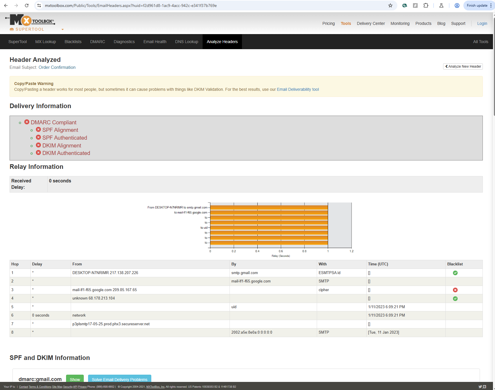
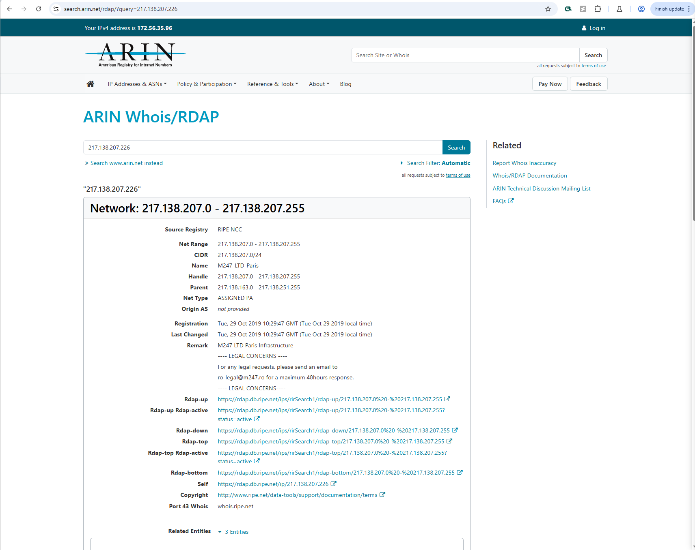
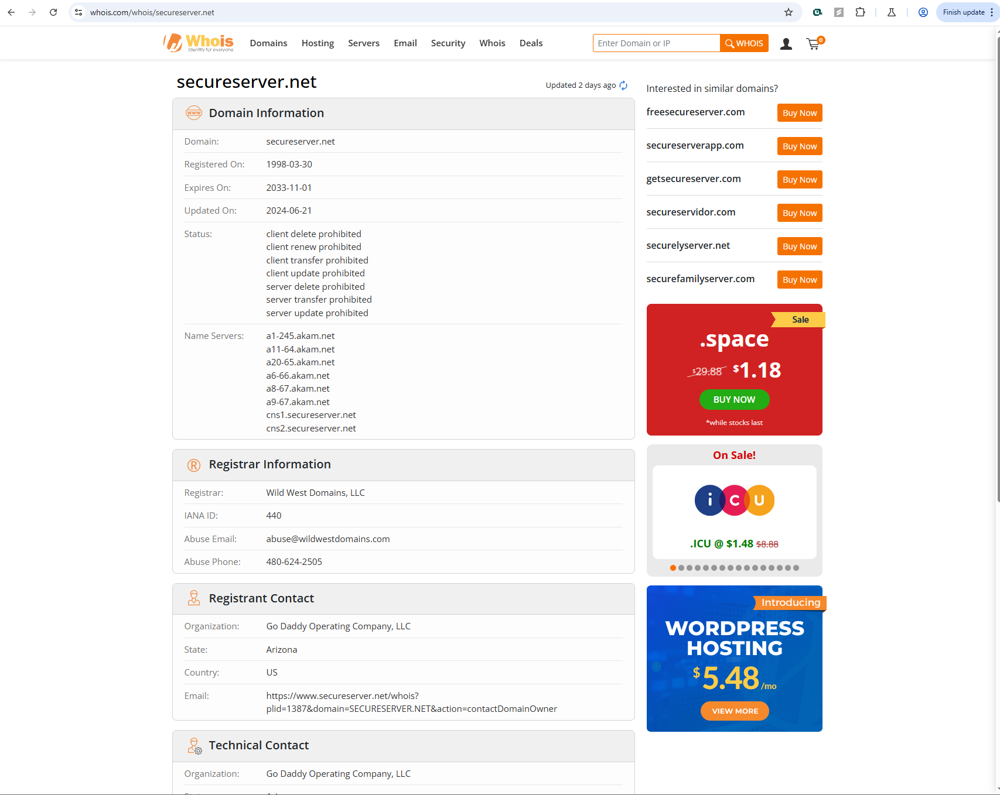
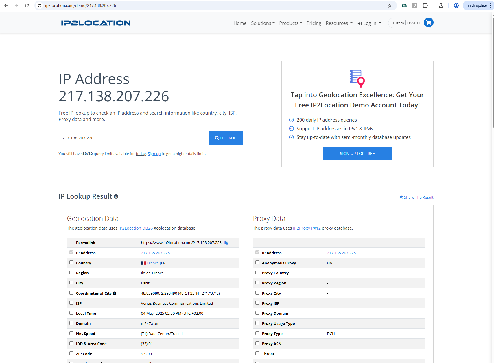
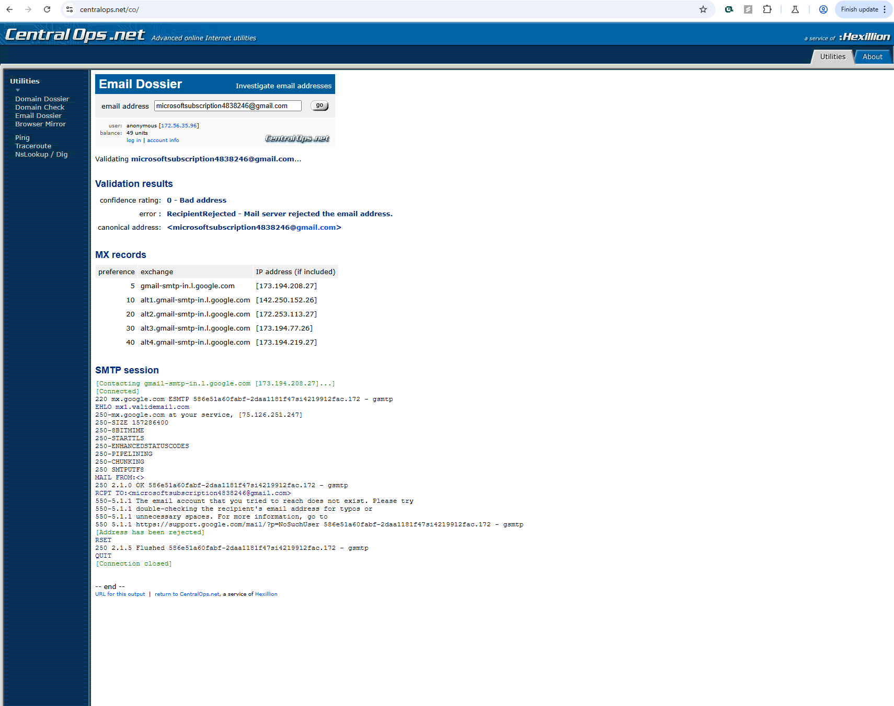

# Assisted Lab: Email Header Analysis and Context Awareness

## Lab Overview

In this lab, I analyzed a suspicious email message received by a Structureality Inc. employee, using both the built-in tools in the virtual lab and various internet-based resources. The goal was to uncover details about the origin, authenticity, and potential threat of the message by evaluating email headers and researching metadata across multiple external platforms.

---

## Objectives

- Analyze the full email header of a suspicious message.
- Determine sender origin and infrastructure using tools like MXToolbox, ARIN, WHOIS, IP2Location, CentralOps, and more.
- Apply **context awareness** to assess whether the message posed a security threat.

---

## Email Overview

- **Sender Address:** `microsoftsubscription4838246@gmail.com`
- **Subject:** Thank you for your order
- **Claimed Source:** Microsoft (but not sent from a Microsoft-owned domain)

Screenshot of the suspicious email message claiming to be from Microsoft, sent from a Gmail address.

## Tools Used

| Tool/Platform          | Purpose                                                    |
| ---------------------- | ---------------------------------------------------------- |
| **MXToolbox**          | Header analysis, trace email route, inspect SPF/DKIM/DMARC |
| **ARIN.net**           | IP address ownership and registration details              |
| **WHOIS.com**          | Domain registration details                                |
| **IP2Location**        | Geolocation of sender IP                                   |
| **CentralOps.net**     | Email reputation and domain details                        |
| **Thatsthem.com**      | Reverse email lookup                                       |
| **HaveIBeenPwned.com** | Check if email has been part of known breaches             |

---

## Key Findings

### 1. Suspicious Sender Behavior

- **From Address:** A Gmail account was used to impersonate Microsoft.
- **Reply-To:** Same as From address — no corporate routing.
- **Domain Mismatch:** No connection to any Microsoft infrastructure.

### 2. Email Routing Analysis

- **Initial IP Address (Hop 1):** `217.138.207.226`
  - Registered to **M247-LTD-Paris**, a legitimate hosting provider.
  - Geolocation traced to **Paris, France** via IP2Location.
- **Mail Server (Hop 7):** `p3plsmtp17-05.prod.phx3.secureserver.net`
  - Registered to **GoDaddy**, not affiliated with Microsoft.

MXToolbox header analysis showing the email relay path and failed alignment with Microsoft infrastructure.

ARIN search shows the source IP belongs to M247-LTD-Paris, a European hosting provider.

WHOIS results indicate the mail server is registered under GoDaddy Operating Company, not Microsoft.

IP2Location places the sending IP in Paris, France.

### 3. Authentication Results

| Auth Method | Result | Notes                                               |
| ----------- | ------ | --------------------------------------------------- |
| **SPF**     | Pass   | Based on Gmail domain (not the impersonated domain) |
| **DKIM**    | Pass   | Also based on Gmail                                 |
| **DMARC**   | Pass   | Again, applies to Gmail only                        |

| These results are misleading since the attacker leveraged Gmail’s legitimate authentication to gain trust.

### 4. Additional Research Results

- **Thatsthem.com:** No known user tied to the Gmail address.
- **HaveIBeenPwned:** No breach records for the email address.
- **WHOIS (GoDaddy server):** Domain registered since 1998, legitimate provider but commonly abused.
- **Desktop Name:** DESKTOP-N7NRIMR (likely default and randomly generated)

CentralOps analysis indicates no significant history or reputation for the sender’s Gmail address.

The Gmail address has not appeared in any known breach databases according to HaveIBeenPwned.

## Context Awareness Application

Although standard authentication mechanisms passed (SPF/DKIM/DMARC), deeper header inspection and external verification revealed:

- **Impersonation of Microsoft**
- **Use of a residential-looking Gmail account**
- **Suspicious infrastructure routing**
- **No historical ties to a known identity**

> **Conclusion:** This email is highly suspicious and fits the pattern of a phishing or social engineering attack designed to impersonate a legitimate vendor. A cautious security posture should treat it as malicious.

---

## Recommendations

- **Report email to internal security team or email provider.**
- **Use tools like VirusTotal to evaluate any included links.**
- **Educate users to be cautious of vendor impersonation using free email providers.**

---

## Sample Tool Links

- [MXToolbox Header Analyzer](https://mxtoolbox.com/Public/Tools/EmailHeaders.aspx)
- [ARIN IP Lookup](https://www.arin.net/)
- [IP2Location](https://www.ip2location.com/)
- [WHOIS Domain Lookup](https://whois.com/whois)
- [HaveIBeenPwned](https://haveibeenpwned.com/)
- [CentralOps Email Dossier](https://centralops.net/)
- [Thatsthem Reverse Email Lookup](https://thatsthem.com/reverse-email-lookup)

---

## Outcome

This lab helped build foundational skills in **email header analysis** and taught how to leverage **public resources** to validate the identity and legitimacy of email senders. The process also emphasized how critical **contextual awareness** is in modern threat detection.
