# Assisted Cybersecurity Lab: Analyzing Vulnerability Reports

## Overview

This lab involved analyzing vulnerability scan reports using the Greenbone Security Assistant (GSA) to identify exploitable weaknesses in a legacy internal Windows Server 2016 system (MS10) within Structureality Inc.'s server subnet. Both **credentialed** and **uncredentialed** scans were reviewed to compare detection depth and evaluate vulnerabilities through CVE and CVSS analysis.

## Objectives

This lab aligns with CompTIA CySA+ objectives:

- 2.1 Implement vulnerability scanning methods and concepts
- 2.2 Analyze output from vulnerability assessment tools
- 2.3 Prioritize vulnerabilities based on data
- 4.1 Communicate vulnerability management findings

---

## Lab Environment

- **Workstation:** Kali Linux VM (`KALI`)
- **Target:** Windows Server 2016 VM (`MS10`)
- **Tool:** Greenbone Security Assistant (GSA), formerly OpenVAS
- **Access Method:** GSA web interface via `https://127.0.0.1:9392`

---

### Step 1: Launching the GSA Interface

```bash
gvm-start
```

After startup, accessed GSA via Firefox on https://127.0.0.1:9392.

#### Login Credentials:

- Username: admin
- Password: Pa$$w0rd

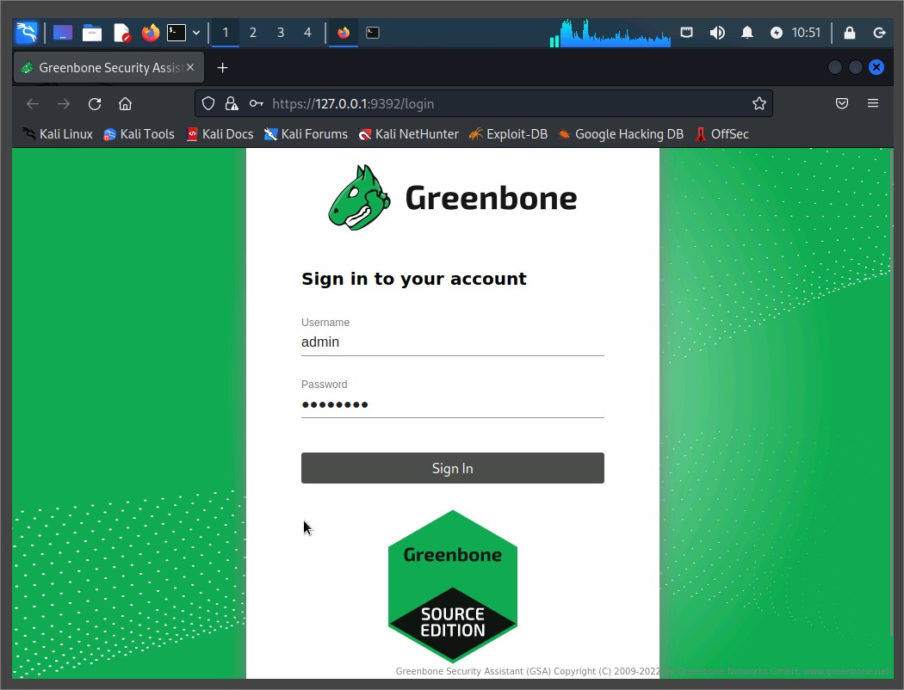
GSA login screen
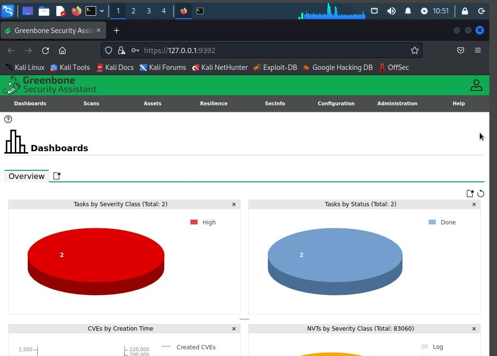
GSA dashboard after login

### Step 2: Reviewing Scan Tasks

From the Scans > Tasks section, two scans were observed:

- MS10 Scan - no creds
- MS10 Scan with creds
  Both showed a Severity of 10.0 (High).

### Step 3: Analyzing Credentialed Scan Report

Navigated to Scans > Reports, and opened the report dated Thu, Jan 12, 2023 11:04 PM UTC.

#### Key Tabs Reviewed:

- Information: General scan summary
- Results: Vulnerabilities sorted by severity
- Hosts: Details on MS10, including IP, OS, ports
- CVEs and Closed CVEs: Categorized vulnerability status
- Others: Applications, OS, Ports, TLS Certificates, etc.

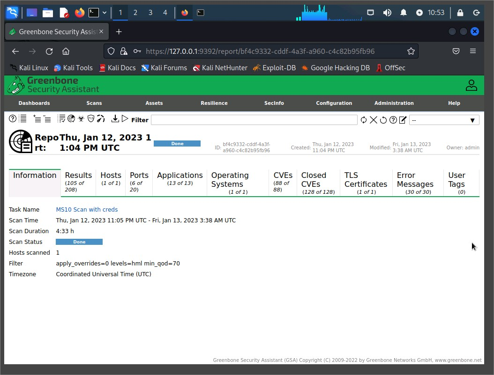
Report overview (Information tab)
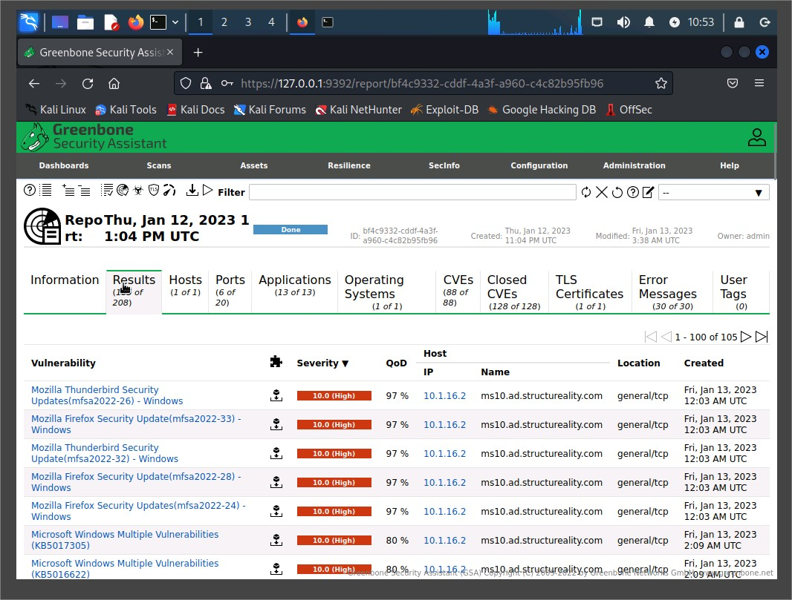

Results tab showing sorted vulnerabilities
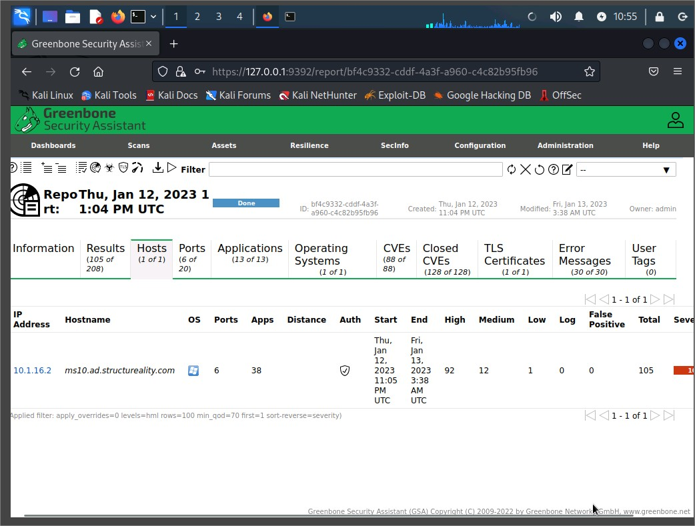
Hosts tab showing MS10 info

#### Exported Report:

- Downloaded as PDF for documentation.
  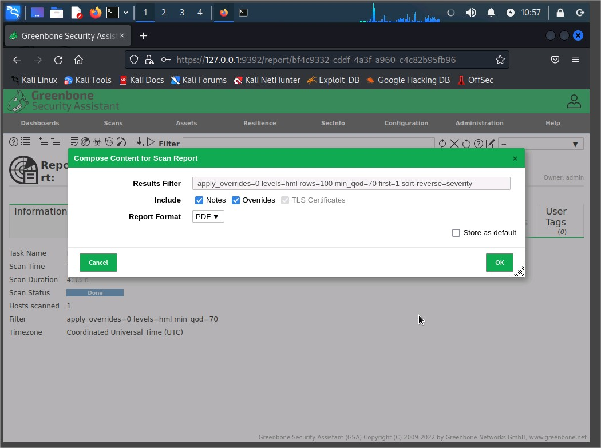

Export report dialog with "PDF" selected

### Step 4: Analyzing Uncredentialed Scan Report

Viewed report from Thu, Jan 12, 2023 11:03 PM UTC under Reports.
Compared to the credentialed scan, this one had:

- Fewer vulnerabilities
- Less depth in results

#### Reason:

Credentialed scans can probe deeper into the system and detect more vulnerabilities due to elevated access rights.

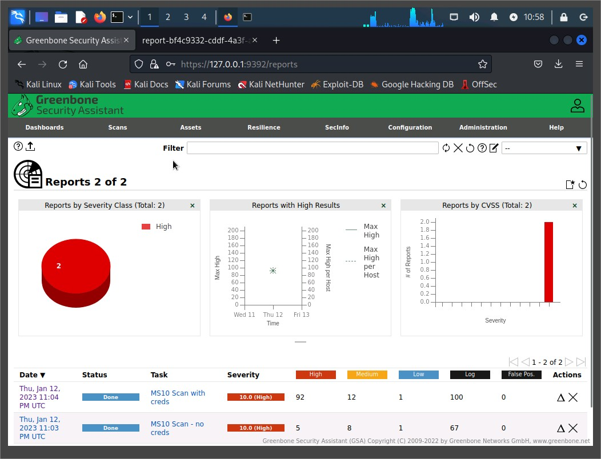

Uncredentialed scan results for comparison

### Step 5: Viewing Aggregated Results

Selected Scans > Results to view a cumulative list of all discovered vulnerabilities.

- Over 200 entries sorted by severity
- Used filter to search for notepad vulnerabilities

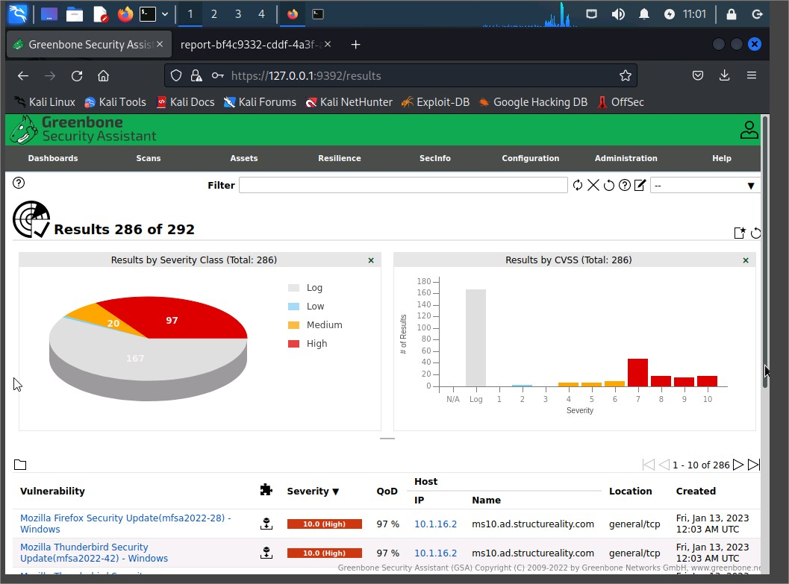

Full results page
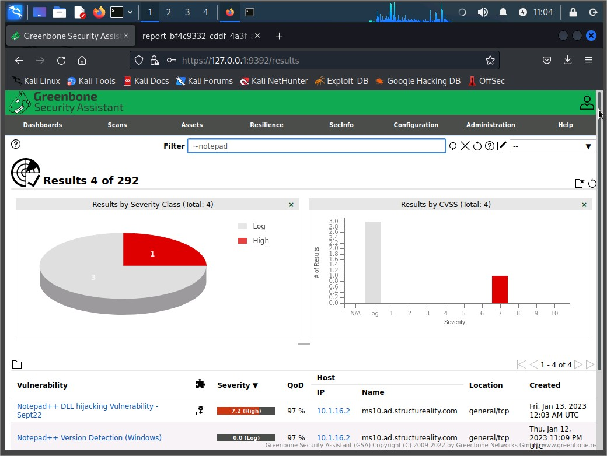

Filtered result for Notepad++ DLL Hijacking

### Step 6: Exploring CVE Details

- Investigated: Notepad++ DLL Hijacking Vulnerability - Sept22
- CVE: CVE-2022-32168
- Severity: 7.8 (High)
- Vendor patch available

#### Explored on:

- MITRE CVE site
- NIST NVD site

#### CVSS Breakdown:

- Base Score: 7.8
- Explored Temporal and Environmental metrics to simulate scoring impacts

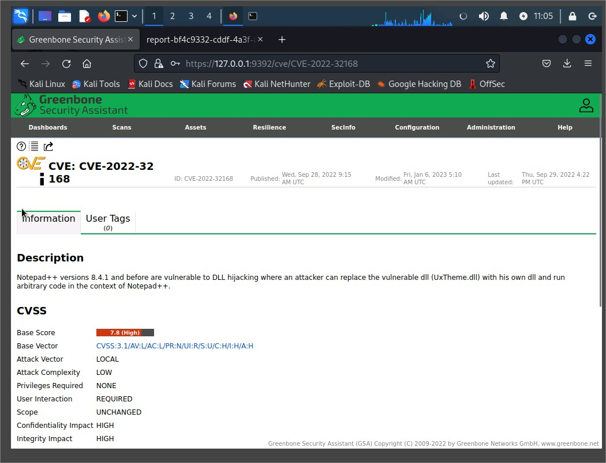
GSA CVE summary for CVE-2022-32168
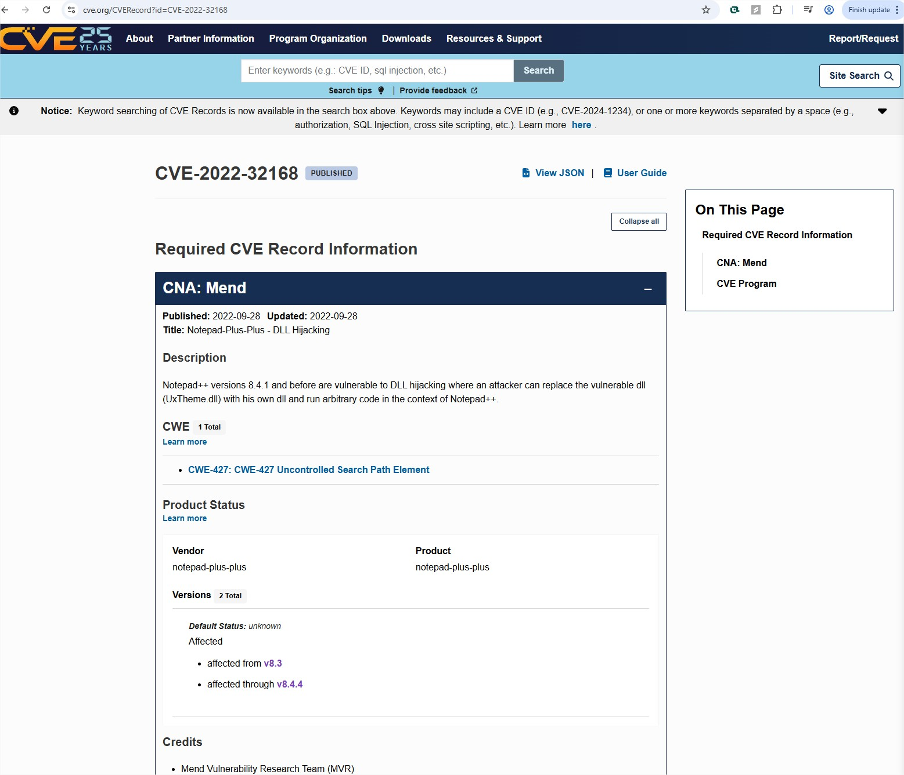
: CVE page on NVD showing 7.8 High score
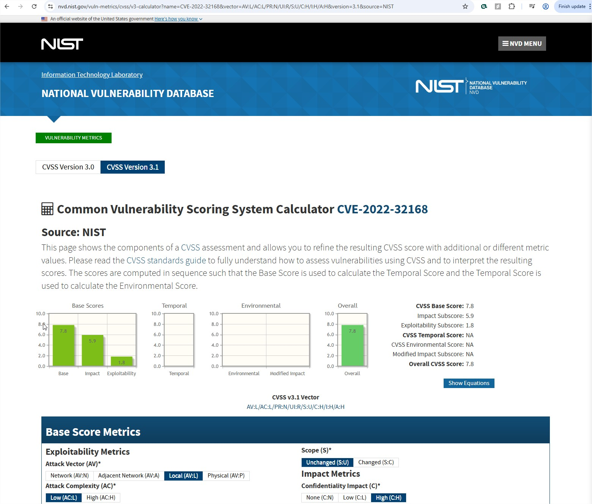

CVSS calculator with vector breakdown

## Key Takeaways

- Credentialed scans reveal more vulnerabilities by accessing authenticated system info.
- CVEs provide standardized identifiers for vulnerabilities and link to vendor solutions.
- CVSS scores help prioritize vulnerabilities based on severity and context.

## References

- Greenbone Security Assistant (GSA)
- CVE Database (MITRE)
- National Vulnerability Database (NVD)
- CVSS Scoring Calculator
