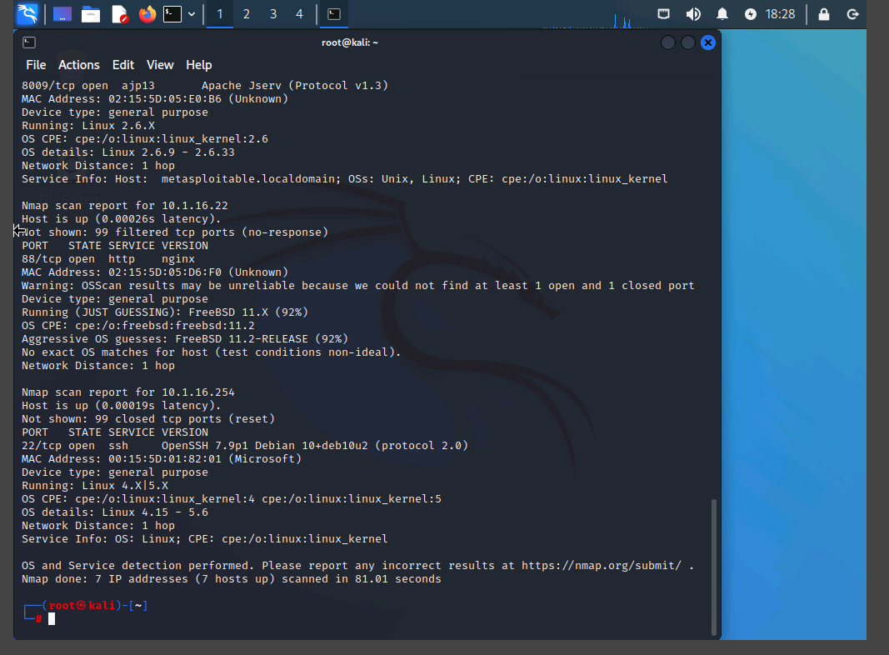
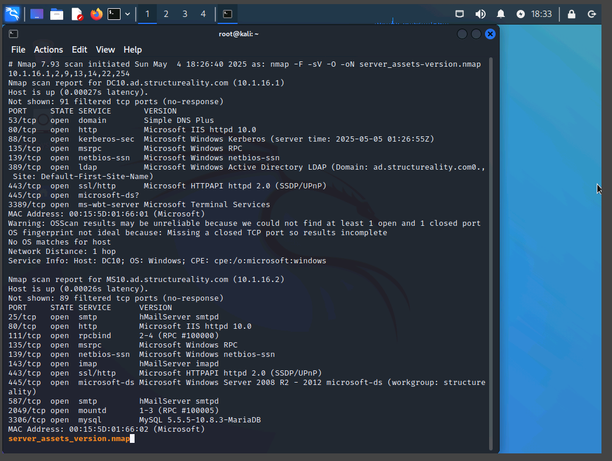
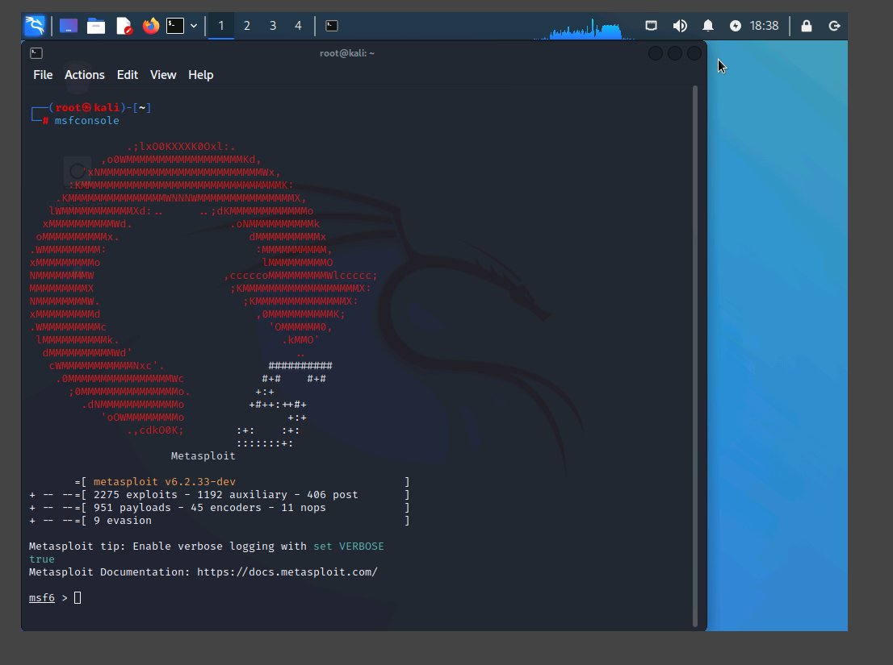
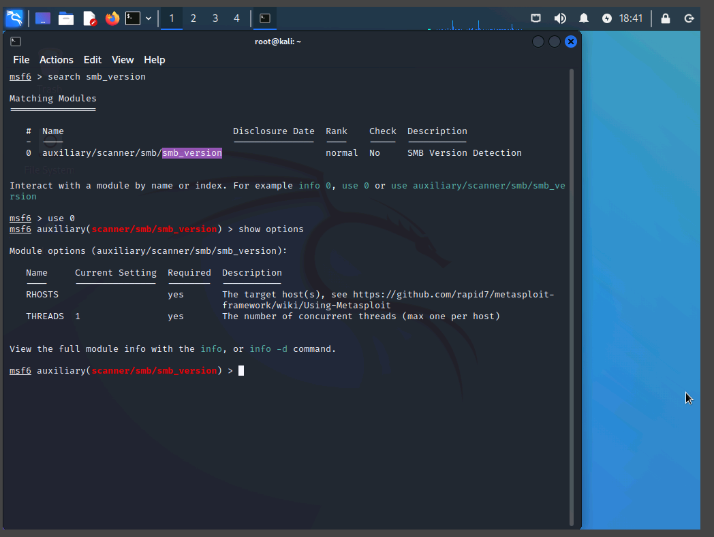
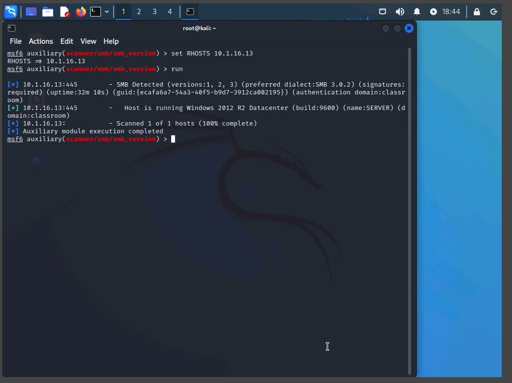
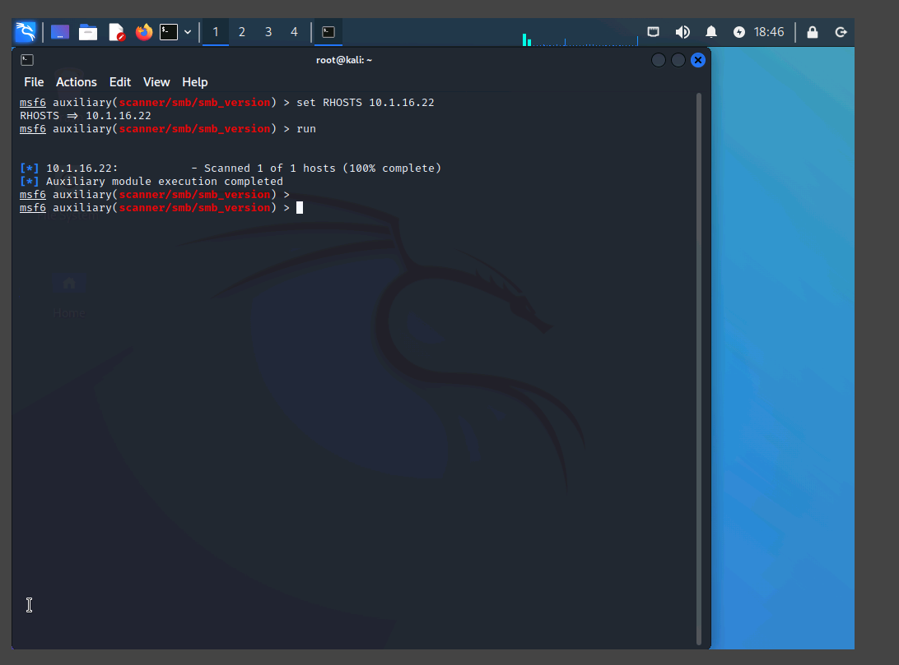
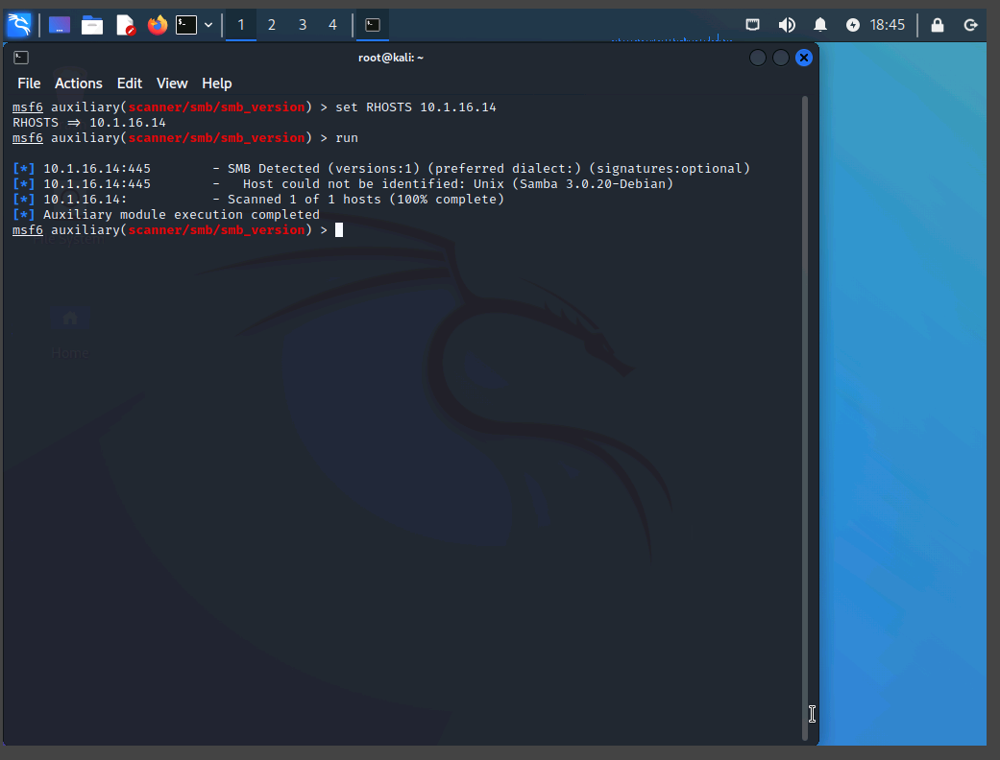

# Assisted Lab: OS Fingerprinting and Legacy System Detection

## Objective

Identify operating systems (OS) across a network using **active fingerprinting techniques** and determine which systems are **legacy (end-of-support)**. This enables proactive risk management by flagging systems that may require upgrades or retirement.

---

## Tools Used

- `nmap` (Network Mapper)
- `msfconsole` (Metasploit Framework)
- Public sources for support lifecycle data:
  - [List of Microsoft Windows versions](https://en.wikipedia.org/wiki/List_of_Microsoft_Windows_versions)
  - [Linux kernel version history](https://en.wikipedia.org/wiki/Linux_kernel_version_history)
  - [FreeBSD version history](https://en.wikipedia.org/wiki/FreeBSD_version_history)
  - [Debian version history](https://en.wikipedia.org/wiki/Debian_version_history)

---

## Part 1: OS Detection with Nmap

### Scanning the Server Network

Used `nmap` with OS detection (`-O`) to identify systems within `vLAN_SERVERS`.

```bash
nmap 10.1.16.<Server_Host_IPs> -F -sV -O -oN server_assets_version.nmap
```

Where:

- -O: Enables OS detection
- -oN: Output in human-readable format

Nmap Detection Results
|IP Address |OS Detected |
|------------ |------------ |
|10.1.16.1 | Windows Server 2019 |
|10.1.16.2 | Windows Server 2016 |
|10.1.16.9 | Windows 7 / Vista / 2008 |
|10.1.16.13 | Windows Server 2012 |
|10.1.16.14 | Linux 2.6.9 – 2.6.33 |
|10.1.16.22 | FreeBSD 11.2 |
|10.1.16.242 | Linux 4.15 – 5.6 |
|10.1.16.254 | Linux 4.15 – 5.6 |
|10.1.16.66 | Debian 12.2.0 |

Note: Some OS versions are estimated ranges due to the nature of passive and semi-active OS fingerprinting by Nmap.


Nmap scan output showing OS detection across the server network.


Reviewing detailed Nmap OS scan results with less

## Part 2: OS Refinement with Metasploit

### Running smb_version Auxiliary Module

```bash
msfconsole
search smb_version
use auxiliary/scanner/smb/smb_version
```


Metasploit Framework loading in the terminal.


Configuring the Metasploit smb_version scanner for a target.

For each target:

```bash
set RHOSTS <target_ip>
```





smb_version module results: different OS and SMB variants discovered.

### Refined Metasploit Results

| IP Address  | OS Identified              | Notes                    |
| ----------- | -------------------------- | ------------------------ |
| 10.1.16.2   | Windows Server 2016        | Confirmed                |
| 10.1.16.9   | Windows 7 Ultimate SP1     | More accurate than Nmap  |
| 10.1.16.13  | Windows 2012 R2 Datacenter | Confirms Nmap guess      |
| 10.1.16.14  | SAMBA / Linux              | SMB emulator detected    |
| 10.1.16.22  | No response                | Likely no SMB service    |
| 10.1.16.242 | No response                | Timeout (no SMB service) |
| 10.1.16.254 | No response                | Timeout (no SMB service) |

## Part 3: Identifying Legacy Systems

A legacy system is one that is no longer supported (End of Support or End of Service Life), which introduces serious security risks.

### EOS/EOSL Evaluation Summary

| IP Address  | OS                         | EOS / EOSL Date | Status     |
| ----------- | -------------------------- | --------------- | ---------- |
| 10.1.16.1   | Windows Server 2019        | 2029-01-09      | ✅ Current |
| 10.1.16.2   | Windows Server 2016        | 2027-01-12      | ✅ Current |
| 10.1.16.9   | Windows 7 Ultimate SP1     | 2020-01-14      | ⚠️ Legacy  |
| 10.1.16.13  | Windows 2012 R2 Datacenter | 2023-10-10      | ⚠️ Legacy  |
| 10.1.16.14  | Linux 2.6.9 – 2.6.33       | 2004–2011       | ⚠️ Legacy  |
| 10.1.16.22  | FreeBSD 11.2               | 2019-10-31      | ⚠️ Legacy  |
| 10.1.16.242 | Linux 4.15 – 5.6           | 2018–2020       | ⚠️ Legacy  |
| 10.1.16.254 | Linux 4.15 – 5.6           | 2018–2020       | ⚠️ Legacy  |
| 10.1.16.66  | Debian 12.2.0              | TBD             | ✅ Current |

### Conclusions & Recommendations

- Legacy Systems Identified:

  - Windows 7, Windows Server 2012 R2
  - Older Linux kernels (2.6 and early 4.x series)
  - FreeBSD 11.2

- Action Required:
  - Notify the security team to prioritize mitigation or retirement of these systems.
  - Consider network isolation or host-based controls if retirement is not immediately feasible.

### Key Takeaways

- Combining Nmap and Metasploit increases OS detection accuracy.
- Using open-source lifecycle references can quickly identify unsupported systems.
- Legacy systems introduce risk and should be identified and addressed during security assessments.
