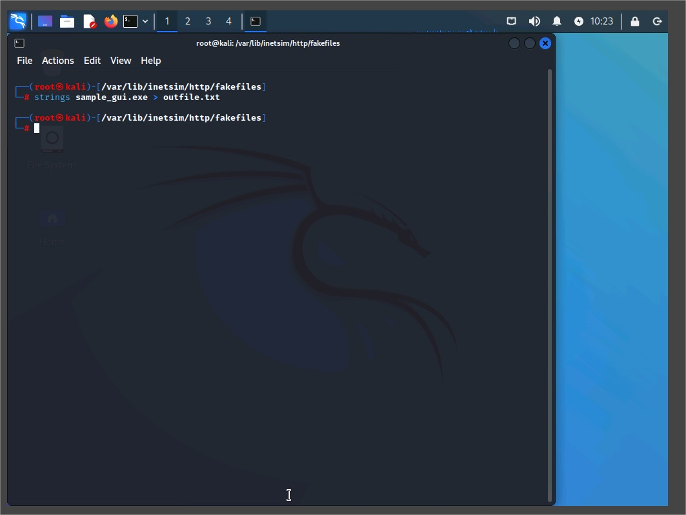

# Assisted Lab: Using File Analysis Techniques

This document summarizes the steps and findings from the assisted cybersecurity lab focused on file analysis techniques. The lab was completed using a Kali Linux virtual machine and involved using tools such as `strings`, `md5sum`, and `hexedit` to analyze file content, verify file integrity, and inspect data at a binary level.

## Lab Objectives

- Extract and analyze printable strings from files.
- Verify file integrity using hashing (MD5).
- Perform low-level analysis using a hex editor.

---

## 1. File Analysis with `strings`

### Description

The `strings` utility was used to extract human-readable ASCII characters from various file types within the `/var/lib/inetsim/http/fakefiles` directory.

### Steps

```bash
cd /var/lib/inetsim/http/fakefiles
ls -l
strings sample.txt
strings sample.bmp
strings sample.gif
strings sample.png
strings sample.jpg
```

### Findings

- A 21-character string was found in three of the image files.
- Sample output was redirected from sample_gui.exe for further inspection:

### Steps

```bash
strings sample_gui.exe > outfile.txt
less outfile.txt
```

Notable Strings Found

- This is the INetSim default GUI binary
- !This program cannot be run in DOS mode.
- Created with The GIMP
- Several C functions: abort, fprintf, malloc, etc.


strings sample_gui.exe > outfile.txt

less outfile.txt output

## 2. File Integrity Check with Hashing

### Description

Used md5sum to validate the integrity of a forensic disk image file by comparing hashes from a trusted source.

### Steps

- Mount the ISO: Student-Resources-L22.ISO
- Copy contents to ~/Downloads/
- Extract ZIP file containing disk images

```bash
cp /media/cdrom0/\* /root/Downloads/
cd /root/Downloads
unzip 4-kwsrch-ext3.zip
cd 4-kwsrch-ext3
md5sum ext3-img-kw-1.dd >> 4-kwsrch-ext3-hash.txt
cat 4-kwsrch-ext3-hash.txt
```

### Validation

- The MD5 hash from the file matched the official value listed on the Digital Forensics Tool Testing Project.
- MD5 hash bit length: 128 bits (32 hex characters).


hash comparison between the downloaded file and the calculated value using cat 4-kwsrch-ext3-hash.txt.

## 3. File Analysis with hexedit

### Description

Used hexedit to view and search the forensic image ext3-img-kw-1.dd for strings identified in earlier steps.

### Steps

```bash
strings ext3-img-kw-1.dd >> imageout.txt
less imageout.txt
hexeditor ext3-img-kw-1.dd
```

### Search Terms and Hex Offsets

| String Hex | Offset                 |
| ---------- | ---------------------- |
| KW_SEARCH  | 0x00000470             |
| slacker    | 0x0012E2B0             |
| first      | (found multiple times) |
| lost+found | (multiple occurrences) |
| file3      | (multiple occurrences) |

- Used CTRL+W to search for strings.
- Returned to offset 0x00000000 before each new search.


shows KW_SEARCH at 0x00000470.

shows slacker at 0x0012E2B0.

## Key Takeaways

- strings is effective for identifying readable content in binaries and images.
- Hashes ensure file integrity and help detect tampering or corruption.
- hexedit offers a granular view into binary data, useful for forensic discovery and manual inspection.

## Conclusion

This lab demonstrated foundational techniques used in file analysis and digital forensics. By using tools like strings, md5sum, and hexedit, we were able to extract meaningful information from files, verify file integrity, and locate specific data within a disk image. These skills are critical in real-world cybersecurity investigations, where identifying hidden data, verifying authenticity, and understanding binary structures can provide crucial evidence. The hands-on experience reinforced the value of command-line tools and manual inspection in supplementing automated analysis systems.
