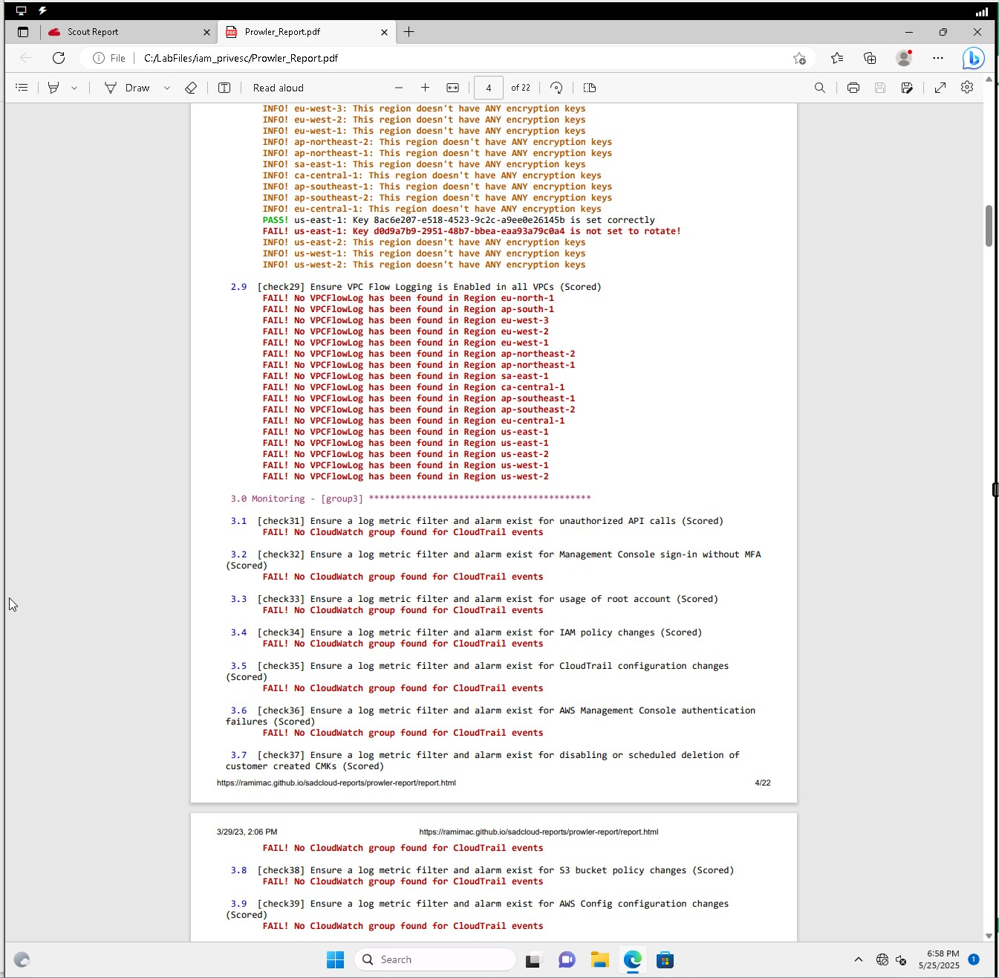

# Assisted Lab: Analyzing Cloud Vulnerabilities

## Lab Scenario

As a security analyst at a tech company that recently migrated operations to the public cloud, you are tasked with identifying non-compliant AWS infrastructure configurations using two cloud security tools: **ScoutSuite** and **Prowler**.

After an overnight ScoutSuite scan and receipt of a third-party Prowler report from a call center acquisition, you must review the findings to assess vulnerabilities and ensure compliance with internal security policy.

---

## Tools Used

### ScoutSuite

ScoutSuite is a multi-cloud security-auditing tool that evaluates a cloud environment's compliance with best practices and security standards. It scans services such as IAM, EC2, VPC, and Config, and labels findings as:

- **Good** (Green)
- **Warning** (Orange)
- **Danger** (Red)

### Prowler

Prowler is a command-line tool that assesses AWS environments for security misconfigurations, focusing on industry benchmarks such as the CIS AWS Foundations Benchmark. It presents a structured report with colored highlights for risk severity.

---

## Security Policy Requirements

The company security policy outlines the following key compliance rules:

### Account Use

- No use of **Root** or **Administrator** accounts by staff
- Enforce strong password policies (length, complexity, expiration)
- Require **MFA** for all privileged accounts
- Root accounts must **not use access keys**

### Monitoring

- Enable **CloudTrail** for account activity
- All **VPCs** must have **Flow Logging**
- Use **AWS Config Recorder** for tracking config changes

### Network & Access Control

- VPC ACLs must restrict access to **essential traffic only**
- **RDP** access to EC2 is allowed **only via JumpBoxes**

---

## Reviewing ScoutSuite Results

ScoutSuite report was reviewed using Microsoft Edge on the Lab-VM.

### IAM Dashboard Analysis

Key Findings:

- **Root Account Used Recently** – Indicates staff may be logging in using the root account.
- **Privileged Accounts Configured Without MFA** – Fails the MFA requirement.
- **Passwords Expire After 90 Days** – Marked as a **Warning**, does not meet stricter internal policy.

ScoutSuite IAM dashboard showing 'Root Account Used Recently' and 'Privileged Accounts Configured Without MFA'

### VPC Dashboard Analysis

Key Findings:

- **VPC Without a Flow Log** – Violates the policy requiring flow logging.
- **Unrestricted Network Traffic within Security Group** – Indicates weak access control.

ScoutSuite VPC dashboard showing flow log issues

### Config Dashboard Analysis

Key Findings:

- **AWS Config Recorder Not Enabled** – Violates the requirement to track configuration changes.

ScoutSuite Config dashboard with AWS Config issues

---

## Reviewing Prowler Report

The Prowler report was provided by the call center's cloud team. It was reviewed to assess integration risk.

### General Observations:

- Prowler uses a text-based color-coded format, showing compliance checks grouped by service (e.g., IAM, EC2, VPC).
- Numerous findings marked as **High Risk** related to:
  - Lack of CloudTrail configuration
  - Overly permissive IAM policies
  - Missing encryption on S3 buckets

Prowler report overview page

### Policy Violations Identified in Prowler:

- **Root account with active access keys** – directly violates internal policy.
- **IAM policies allow wildcards** – introduces unnecessary privilege.
- **Missing MFA on multiple privileged accounts**
- **No VPC Flow Logs** for most subnets.

Specific Prowler findings showing MFA and VPC issues

---

## Summary of Non-Compliant Findings

| Tool       | Service | Policy Area     | Finding                          | Risk Level |
| ---------- | ------- | --------------- | -------------------------------- | ---------- |
| ScoutSuite | IAM     | Account Use     | Root Account Used Recently       | Danger     |
| ScoutSuite | IAM     | Account Use     | Privileged Accounts Without MFA  | Danger     |
| ScoutSuite | IAM     | Password Policy | Passwords Expire After 90 Days   | Warning    |
| ScoutSuite | VPC     | Monitoring      | VPC Without a Flow Log           | Danger     |
| ScoutSuite | Config  | Monitoring      | AWS Config Recorder Not Enabled  | Danger     |
| Prowler    | IAM     | Account Use     | Root Account Using Access Keys   | High       |
| Prowler    | IAM     | Account Use     | No MFA for Privileged Users      | High       |
| Prowler    | VPC     | Monitoring      | VPC Flow Logs Not Enabled        | High       |
| Prowler    | IAM     | Access Control  | Wildcard Permissions in Policies | High       |

---

## Recommendations

1. **Disable root account usage immediately** and remove any associated access keys.
2. **Enforce MFA** on all privileged and administrator accounts.
3. **Update IAM password policy** to include stricter expiration and reuse rules.
4. **Enable VPC Flow Logs** and apply ACLs to restrict unnecessary traffic.
5. **Activate AWS Config Recorder** to track and audit configuration changes.
6. **Audit third-party cloud environments** (such as the call center) for compliance before integration.

---
