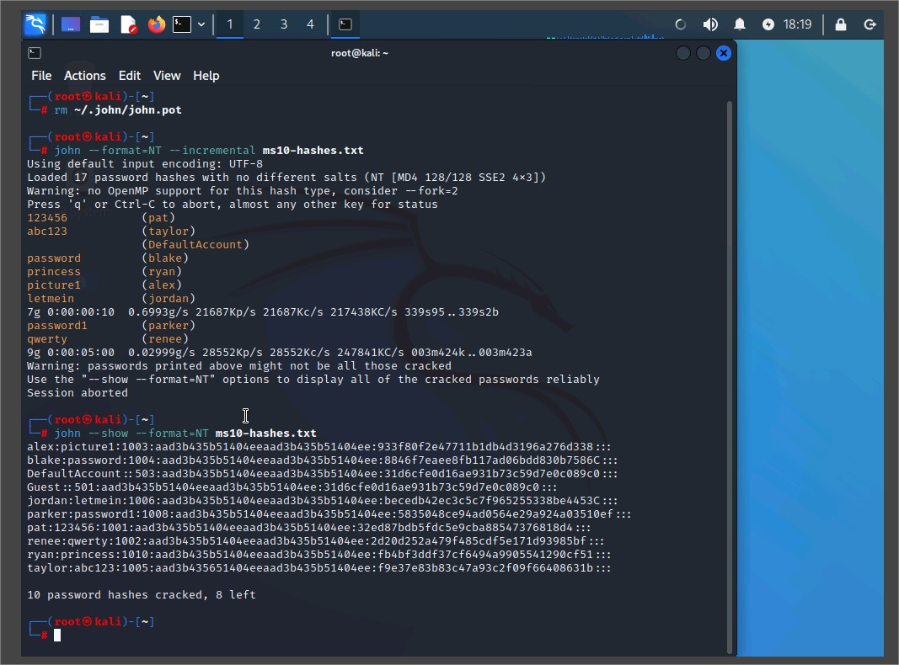

# Exploiting Weak Cryptography - Assisted Cybersecurity Lab

## Lab Overview

This lab demonstrates weaknesses in cryptographic implementations through practical password cracking exercises. As a cybersecurity analyst at Structureality Inc., I used tools like **John the Ripper** and **aircrack-ng** to identify and exploit weak passwords from both Windows hashes and wireless captures.

## Objectives

This lab aligns with the following CompTIA CySA+ objectives:

- **1.1** Explain the importance of system and network architecture concepts in security operations.
- **2.4** Given a scenario, recommend controls to mitigate attacks and software vulnerabilities.

---

## 1. Environment Setup

- **OS**: Kali Linux (VM)
- **Network**: Connected to `vLAN_SERVERS`
- **User**: root / `Pa$$w0rd`

---

## 2. Dictionary Password Crack with John the Ripper

### Steps Performed

1. Displayed hashes:

```bash
cat ms10-hashes.txt
```


ms10-hashes.txt

2. Viewed available password lists:

```bash
ls -lSr /usr/share/seclists/Passwords
```

3. Ran dictionary attack:

```bash
john --format=NT --wordlist=/usr/share/seclists/Passwords/xato-net-10-million-passwords.txt ms10-hashes.txt
```

4. Displayed cracked passwords:

```bash
john --show --format=NT ms10-hashes.txt
```

5. Saved results:

```bash
john --show --format=NT ms10-hashes.txt > dict-cracked.txt
```

6. Viewed remaining uncracked:

```bash
john --show=left --format=NT ms10-hashes.txt
```


Terminal output showing successfully cracked passwords from dictionary attack.

## 3. Brute Force Password Crack with John the Ripper

### Steps Performed

1. Cleared previous session:

```bash
rm ~/.john/john.pot
```

2. Initiated brute force:

```bash
john --format=NT --incremental ms10-hashes.txt
```

3. Observed progress (SPACEBAR) and terminated (q).

4. Saved cracked passwords:

```bash
john --show --format=NT ms10-hashes.txt > brute-cracked.txt
```

5. Tried max length limits:

```bash
john --format=NT --incremental --max-length=6 ms10-hashes.txt
john --format=NT --incremental --max-length=7 ms10-hashes.txt
```


Terminal showing brute force cracking progress.

## 4. Cracking WPA/WPA2 Wireless Passwords with aircrack-ng

### Setup

- Mounted lab ISO: Student-Resources-L29.ISO
- Navigated to capture files:

```bash
cd /media/cdrom0/
ls -la
```

### Dictionary File

Viewed password list:

```bash
cat /root/passwords29.txt
cat /root/passwords29.txt | wc -l
```

### WPA Attack

```bash
aircrack-ng -w /root/passwords29.txt wpa.cap
```


aircrack-ng output showing cracked WPA password.

### WPA2 PSK Attack

```bash
aircrack-ng -w /root/passwords29.txt wpa2-psk-linksys.cap
```


aircrack-ng output showing cracked WPA2 password.

### WPA2 EAPoL Attack

```bash
aircrack-ng -w /root/passwords29.txt wpa2.eapol.cap
```


aircrack-ng cracking WPA2 EAPoL with result.

## 5. Observations

- Weak or short passwords are easily cracked using both dictionary and brute force techniques.
- WPA/WPA2 passwords can be compromised using offline capture files and a proper wordlist.
- EAPoL handshake is more secure than WPA2-PSK but still vulnerable with poor passwords.

## 6. Recommendations

- Enforce complex password policies (length, variety).
- Implement account lockout mechanisms to mitigate live attacks.
- Use WPA3 or 802.1x (ENT) for wireless security instead of WPA/WPA2 PSK.
- Regularly audit password hashes and wireless configurations.

## 7. Files Generated

- dict-cracked.txt: Passwords cracked using dictionary attack
- brute-cracked.txt: Passwords cracked using brute force
- passwords29.txt: Custom dictionary used in aircrack-ng attacks

## 8. Conclusion

This lab reinforces how outdated or improperly implemented cryptography can lead to serious security vulnerabilities. As defenders, understanding attack techniques enables better defense planning and system hardening.
