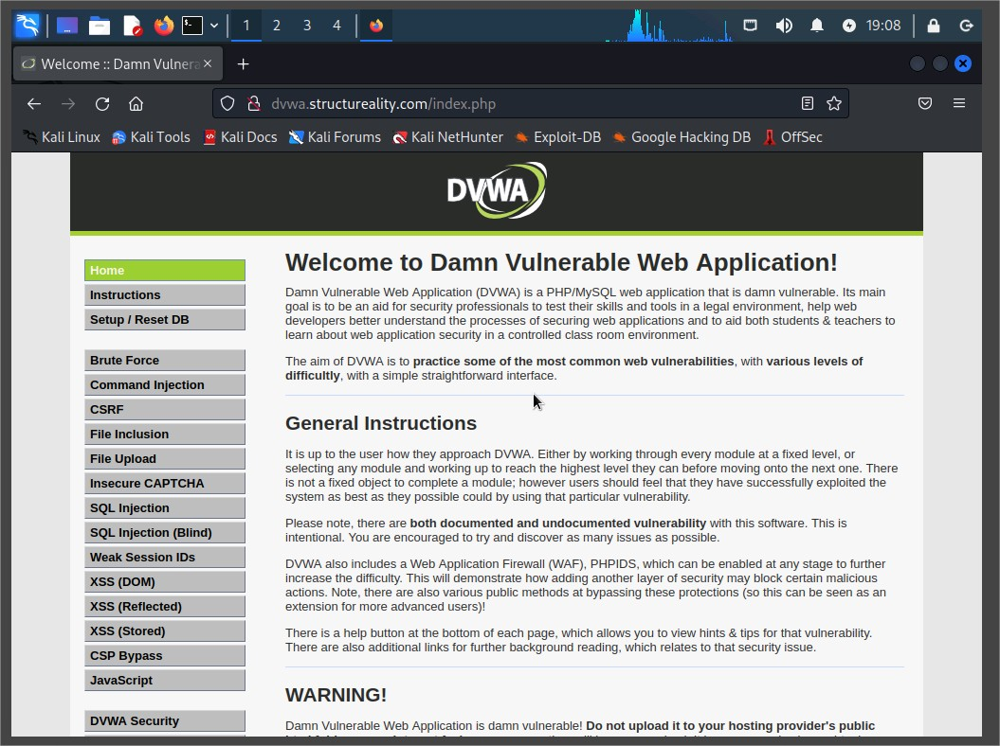
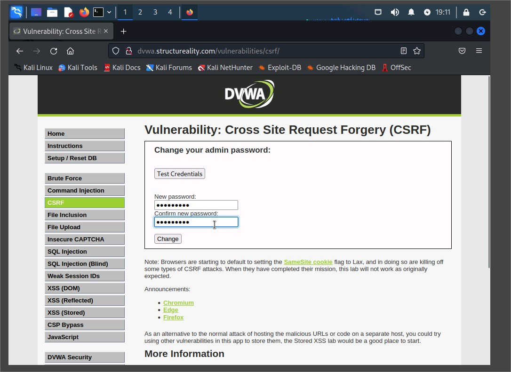
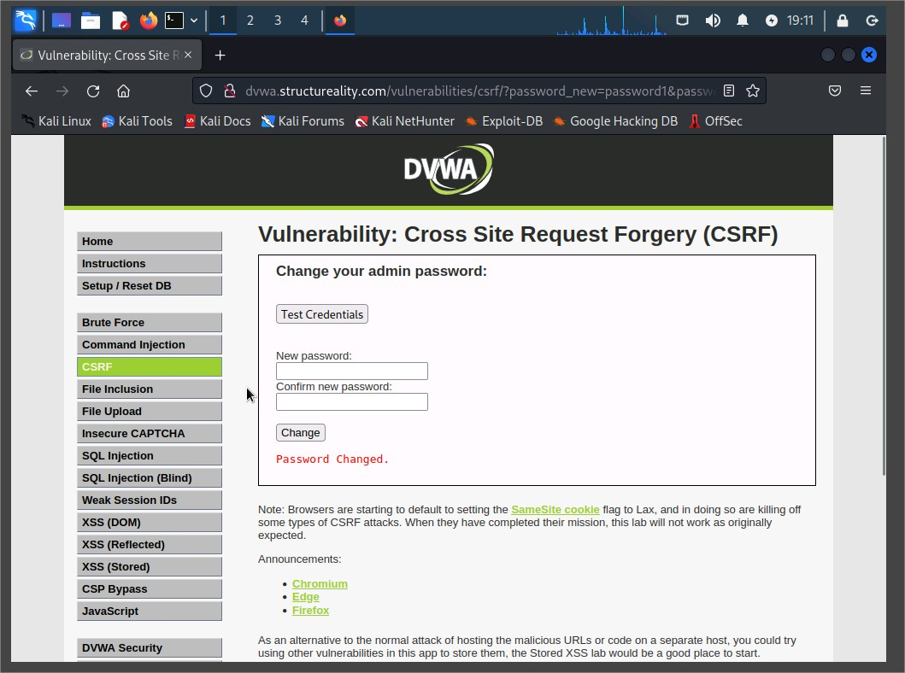
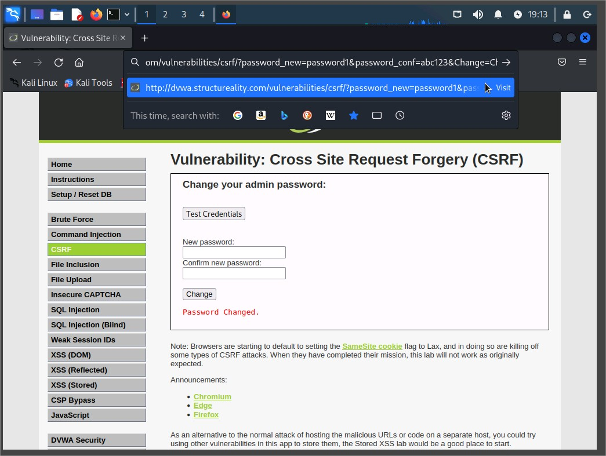
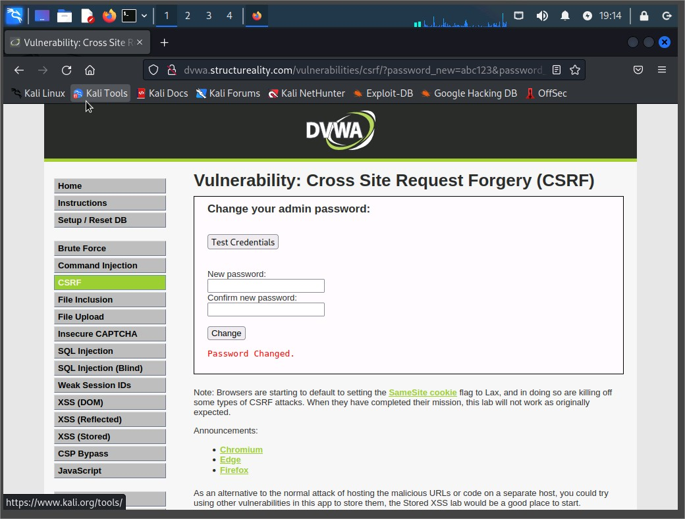
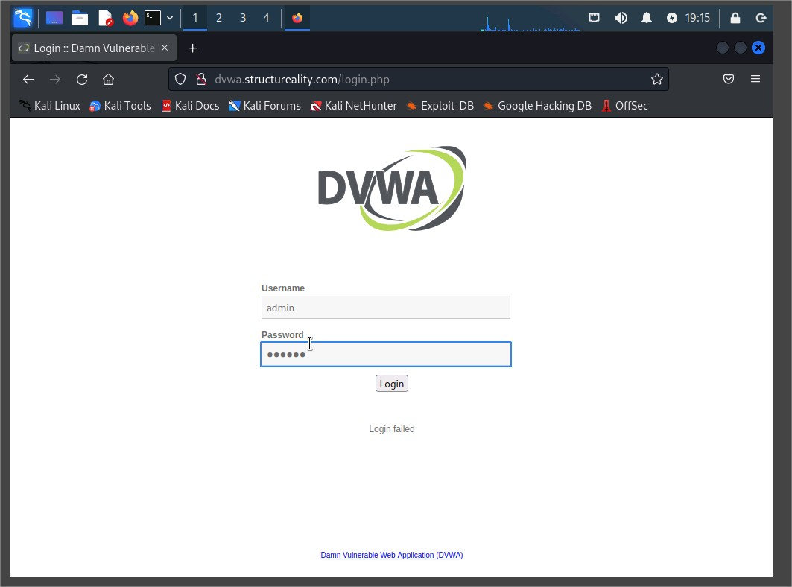
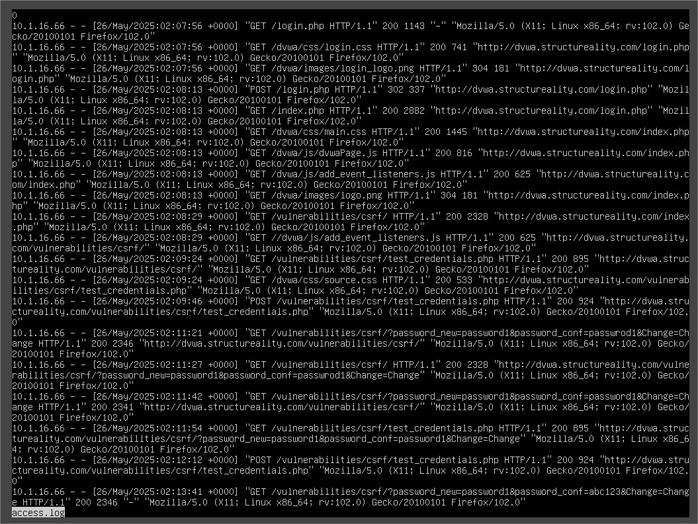

# CSRF Lab Report: Performing and Investigating a Cross-Site Request Forgery Attack

## Overview

This assisted lab guides the user through the process of exploiting a CSRF (Cross-Site Request Forgery) vulnerability using the Damn Vulnerable Web Application (DVWA) on a LAMP VM, followed by investigation of potential IoCs via Apache logs.

---

## Lab Objectives

This lab aligns with the following **CompTIA CySA+ objectives**:

- 1.1: System and network architecture concepts in security operations
- 1.2: Analyze indicators of potentially malicious activity
- 1.3: Use appropriate tools/techniques to determine malicious activity
- 1.4: Threat-intelligence and threat-hunting concepts
- 2.4: Recommend controls to mitigate attacks and software vulnerabilities
- 3.2: Perform incident response activities
- 3.5: Understand attack methodology frameworks

---

## Part 1: Performing a CSRF Attack

### Setup and Access

1. Logged into **Kali Linux** as root.
2. Opened **Firefox** and navigated to `http://dvwa.structureality.com`.
3. Logged into DVWA using:
   - **Username:** `admin`
   - **Password:** `password`
4. Verified that **security level** was set to `Low`.

DVWA home page

---

### Initiating CSRF Vulnerability

1. Navigated to `CSRF` in the left navigation panel.
2. Accessed the password change functionality.

---

### Simulated Legitimate Password Change

1. Entered `password1` as both new and confirmation password.
2. Clicked **Change** and confirmed message: `Password Changed`.
3. Verified new password with Test Credentials.
   
   
   CSRF password change page
   successful password change message.

---

### Simulated CSRF Exploit

1. Crafted URL:
   http://dvwa.structureality.com/vulnerabilities/csrf?password_new=abc123&password_conf=abc123&Change=Change

2. Simulated clicking malicious link by entering the above URL.
3. Confirmed `Password Changed` message.
4. Logged out.
5. Verified login failure with old credentials (`admin` / `password1`).
6. Verified login success with new credentials (`admin` / `abc123`).

   
   
   Browser address bar showing the CSRF exploit URL.
   

Login failure using old password.

---

## Part 2: Investigating the CSRF Attack

### Apache Log Analysis

1. Logged into the **LAMP VM** as `lamp`, elevated to root.
2. Navigated to: `/var/log/apache2/`
3. Opened `access.log` using `less`.

---

### Log Evidence and Indicators

Analyzed log entries in chronological order:

- `GET /vulnerabilities/csrf/` → user accessed CSRF page
- `GET /vulnerabilities/csrf/test_credentials.php`
- `POST /vulnerabilities/csrf/test_credentials.php`
- `GET /vulnerabilities/csrf/password_new=password1&password_conf=password1&Change=Change`
- `GET /vulnerabilities/csrf/password_new=abc123&password_conf=abc123&Change=Change`

**Important Observations:**

- Passwords are exposed in URLs and thus logged — a critical security flaw.
- Evidence of CSRF exists but appears indistinguishable from normal activity.

  

- Terminal showing access to `/var/log/apache2` and using `less` on `access.log`.
- Highlighted lines in `access.log` showing GET/POST requests with password changes.
- A log section showing both successful and failed login patterns.

---

### Login Patterns

**Failed Login Pattern:**

- GET /login.php
- POST /login.php "http://dvwa.structureality.com/login.php"
- GET /login.php "http://dvwa.structureality.com/login.php"

**Successful Login Pattern:**

- GET /login.php
- POST /login.php "http://dvwa.structureality.com/login.php"
- GET /index.php "http://dvwa.structureality.com/login.php"

---

### Key Takeaways

- The CSRF exploit changed the admin password without proper authentication.
- Apache logs confirmed vulnerable design via URL-based password changes.
- No single log entry definitively proves a CSRF attack — **context is critical**.

---

## Mitigation Recommendations

- Use **POST** instead of **GET** for sensitive operations.
- Implement **CSRF tokens** on forms.
- Require current password before changing.
- Use **HTTPS** throughout the application.
- Avoid logging sensitive data like passwords.

---

## Conclusion

This lab demonstrated a full cycle of exploiting and analyzing a CSRF vulnerability. It underscores the subtle nature of CSRF and the importance of secure design practices, contextual log analysis, and thorough incident investigation.
